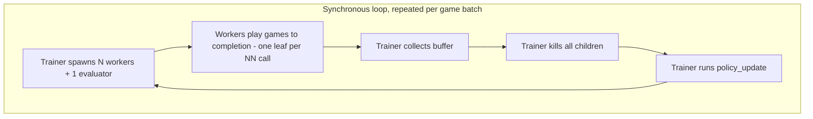
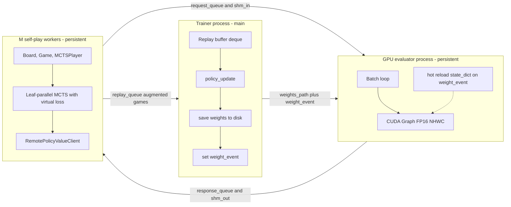
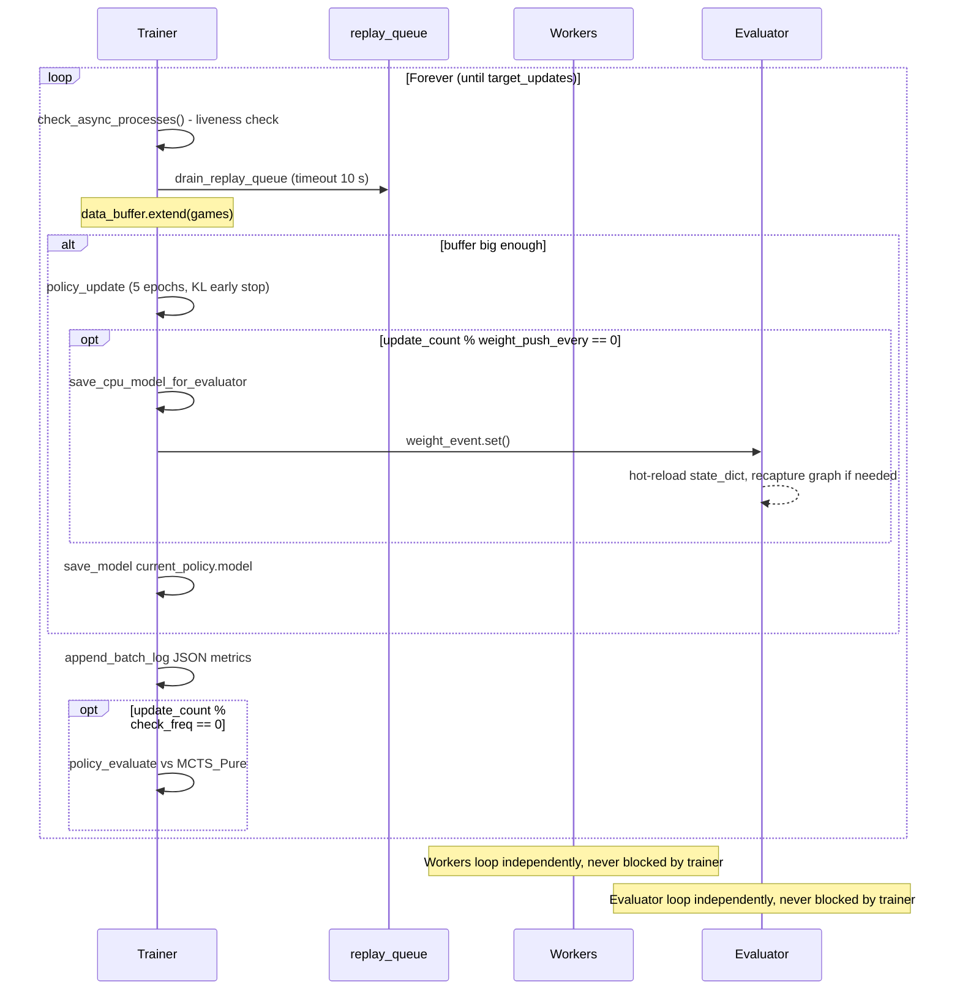
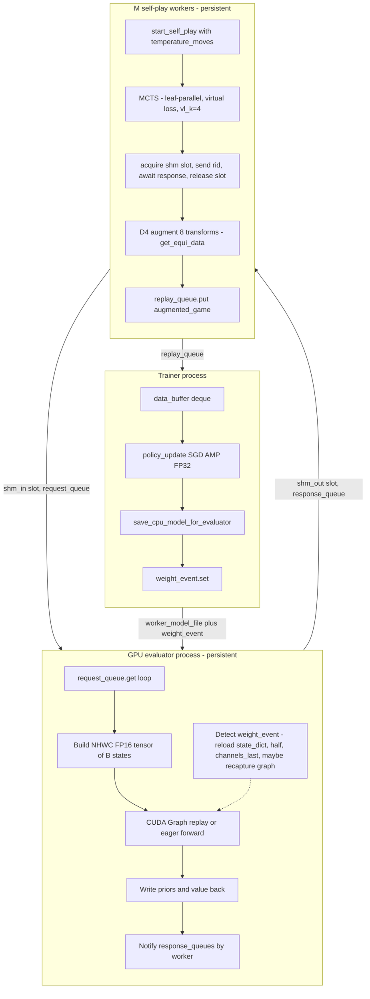

# Optimized AlphaZero Gomoku Training Pipeline — Developer Documentation

> **Audience.** Engineers maintaining or extending the AlphaZero Gomoku training stack on a 12-core CPU + NVIDIA V100 16 GB host. This document describes the four optimization phases that transformed the original synchronous, single-leaf-per-batch trainer into an asynchronous, leaf-parallel, FP16-accelerated pipeline modeled on the AlphaGo Zero paper (Silver et al., *Nature* 550, 2017).
>
> **Source spec.** [`alphazero_gomoku_optimization_guide.md`](../alphazero_gomoku_optimization_guide.md:1).
> **Implementation tracker.** [`plans/alphazero_pipeline_optimization_plan.md`](../plans/alphazero_pipeline_optimization_plan.md:1).
> **Status.** Phases 1 – 4 landed and live in the codebase. Tasks 6, 8, 9, 10, 11 from the source spec are deferred follow-ups.

---

## Table of Contents

1. [Why we optimized — bottleneck analysis](#1-why-we-optimized--bottleneck-analysis)
2. [Architecture: before vs after](#2-architecture-before-vs-after)
3. [Phase 1 — Temperature schedule & Dirichlet tuning](#3-phase-1--temperature-schedule--dirichlet-tuning)
4. [Phase 2 — CPU savers & batched MCTS](#4-phase-2--cpu-savers--batched-mcts)
5. [Phase 3 — Persistent async pipeline & shared-memory IPC](#5-phase-3--persistent-async-pipeline--shared-memory-ipc)
6. [Phase 4 — GPU unleashed: FP16, channels_last, CUDA Graphs](#6-phase-4--gpu-unleashed-fp16-channels_last-cuda-graphs)
7. [End-to-end data flow (steady state)](#7-end-to-end-data-flow-steady-state)
8. [Configuration reference & new CLI arguments](#8-configuration-reference--new-cli-arguments)
9. [Operational notes & gotchas](#9-operational-notes--gotchas)

---

## 1. Why we optimized — bottleneck analysis

The hardware target is a **12-core CPU paired with a single NVIDIA V100 16 GB**. Before optimization the trainer left both sides of the machine partially idle:

| Layer | Pre-optimization behavior | Why it was a bottleneck |
|---|---|---|
| **MCTS** | 1 leaf → 1 NN call → 1 backup, sequentially | The GPU evaluator's effective batch size was bounded by `num_workers` (~10). The V100 was forwarding tiny batches with most kernel time spent on launch overhead. |
| **`Board` copy** | [`copy.deepcopy`](https://docs.python.org/3/library/copy.html) per playout | With `n_playout=800` over ~30 plies/game, that is ~24 000 deep copies per worker per game — top-3 hot function in the CPU profile. |
| **PUCT selection** | `max(_children.items(), key=...)` Python loop | ~150 children × ~15-deep tree × 800 playouts → ~12 000 PUCT evaluations per move per worker, all in pure Python. |
| **Pipeline** | Spawn evaluator + workers every game batch | Each spawn pays CUDA init (~1–2 s) + state-dict load. For a Gomoku game (≈24 s of useful work), 11 fresh processes burned ~30 s of overhead. The GPU went idle during training; the CPU went idle during forwards. |
| **Inference** | FP32 eager `forward()` in NCHW | Tensor Cores on V100 prefer FP16 + NHWC. On the 10×128 ResNet, eager dispatch overhead dominated. |
| **IPC** | `mp.Queue.put(numpy_array)` (pickled) | At ~10⁵ requests/s the pickle/unpickle round trip became measurable. |
| **Self-play data quality** | Fixed temperature (τ ≈ 1e-3) and Go-tuned Dirichlet α (0.03) | The network kept replaying its current best opening; replay buffer covered too few distinct openings to learn from. |

The four phases below each target one or more of these layers. They are independent in design but were sequenced so each phase could be benchmarked in isolation.

---

## 2. Architecture: before vs after

### 2.1 Before (synchronous, spawn-per-batch)



Bottlenecks: spawn cost per batch, single-leaf MCTS, GPU starved, CPU idle during training.

### 2.2 After (asynchronous, persistent, leaf-parallel, batched)



Each MCTS playout collects up to `vl_k=4` non-terminal leaves before issuing one batched NN call. With 10 workers × 4 leaves the in-flight pool is ~40 — well-suited to the V100.

---

## 3. Phase 1 — Temperature schedule & Dirichlet tuning

**Goal.** Improve self-play *data quality* before any throughput change. Cheap to implement, easy to roll back, gives a clean baseline for later phases.

**Files touched.**
- [`game.py`](../game.py:215) — [`Game.start_self_play()`](../game.py:215)
- [`mcts_alphaZero.py`](../mcts_alphaZero.py:343) — [`MCTSPlayer.__init__`](../mcts_alphaZero.py:346) defaults
- [`train_gpu_evaluator.py`](../train_gpu_evaluator.py:708) — [`TrainPipeline.__init__`](../train_gpu_evaluator.py:709) defaults + CLI

### 3.1 Temperature schedule

The AlphaGo Zero paper applies τ = 1 for the first 30 plies (≈12% of a Go game) and τ → 0 thereafter. In the original code, `temp` was a single fixed value passed to `Game.start_self_play()` — opening positions in the buffer were dominated by the network's current top move.

We added a **per-move temperature schedule** to [`Game.start_self_play`](../game.py:215):

```python
def start_self_play(self, player, is_shown=0, temp=1e-3,
                    temperature_moves=None, temp_high=1.0,
                    temp_low=1e-3):
    ...
    while True:
        cur_temp = temp
        if temperature_moves is not None:
            cur_temp = temp_high if move_idx < temperature_moves else temp_low
        move, move_probs = player.get_action(self.board,
                                             temp=cur_temp,
                                             return_prob=1)
        states.append(self.board.current_state().copy())
        ...
```

Key points:
- `temperature_moves=None` keeps the legacy fixed-temperature path for backward compatibility.
- `temperature_moves=8` is the new default for Gomoku 15×15 (~20% of the average 30-ply game). Gomoku games are shorter than Go so the fraction is bumped up.
- `states.append(...current_state().copy())` is **defensive** — it guarantees correctness even after Phase 2 / Task 6 caches `current_state()` planes incrementally. See `§9` "Pitfalls".

### 3.2 Dirichlet α retuned for Gomoku

The paper formula is `α ≈ 10 / avg_legal_moves`. For an empty Gomoku 15×15 board with 224 legal moves the target is **α ≈ 0.045**, so the new default is `0.05`. The old default `0.03` was inherited from the Go config and noticeably under-explored.

| Parameter | Old default | New default | Rationale |
|---|---|---|---|
| `dirichlet_alpha` | 0.03 | **0.05** | `≈10 / 224 legal moves` |
| `noise_eps` | 0.25 | 0.25 | Unchanged from paper |
| `temperature_moves` | (none) | 8 | ≈20% of avg game; Gomoku-tuned |

### 3.3 Validation signal

After Phase 1, distinct opening prefixes in 100-game samples jumped from a handful to dozens, and the entropy of `mcts_probs` over the first 8 plies rose materially — confirming the buffer was no longer dominated by a single learned opening.

---

## 4. Phase 2 — CPU savers & batched MCTS

**Goal.** Eliminate the three big CPU hotspots in the worker loop and feed the GPU evaluator larger batches. This phase is the single biggest throughput win and is implemented as one cohesive change because all three sub-tasks rewrite the same `TreeNode` storage.

**Files touched.**
- [`game.py`](../game.py:36) — added [`Board.copy_fast`](../game.py:36)
- [`mcts_alphaZero.py`](../mcts_alphaZero.py:16) — full `TreeNode` + `MCTS` rewrite (W/N storage, NumPy children, virtual-loss leaf parallelism)
- [`train_gpu_evaluator.py`](../train_gpu_evaluator.py:71) — [`RemotePolicyValueClient`](../train_gpu_evaluator.py:71) gains [`policy_value_batch_fn()`](../train_gpu_evaluator.py:205)

### 4.1 `Board.copy_fast()` — replace `copy.deepcopy`

`copy.deepcopy(state)` was being called once per playout. We added a hand-rolled shallow-copy method that clones only the mutable move-tracking containers and shares immutable rule constants by reference:

```python
def copy_fast(self):
    new = Board.__new__(Board)
    new.width = self.width
    new.height = self.height
    new.n_in_row = self.n_in_row
    new.players = self.players
    new.states = dict(self.states)
    new.availables = list(self.availables)
    new._available_set = set(self._available_set)
    new._available_pos = dict(self._available_pos)
    new.current_player = self.current_player
    new.last_move = self.last_move
    return new
```

`_available_set` and `_available_pos` are deliberately included — they are mutated by `do_move()` for O(1) availability removal, and skipping them would silently corrupt the legal-move index. This is the most common trap when porting `copy_fast` skeletons from the spec.

### 4.2 Vectorized PUCT selection — NumPy children arrays

[`TreeNode`](../mcts_alphaZero.py:16) was rewritten to store **parallel NumPy arrays** of children stats on each parent node, replacing the Python `dict` of children:

```python
class TreeNode(object):
    __slots__ = ('_parent', '_parent_idx', '_prior', '_children_actions',
                 '_priors', '_N_arr', '_W_arr', '_child_nodes', '_N', '_W')

    def expand(self, action_priors):
        actions, priors = zip(*action_priors)
        self._children_actions = np.asarray(actions, dtype=np.int32)
        self._priors = np.asarray(priors, dtype=np.float32)
        n = len(self._children_actions)
        self._N_arr = np.zeros(n, dtype=np.float32)
        self._W_arr = np.zeros(n, dtype=np.float32)
        self._child_nodes = [None] * n
```

[`TreeNode.select()`](../mcts_alphaZero.py:71) becomes a single vectorized argmax:

```python
def select(self, c_puct):
    q = np.divide(self._W_arr, self._N_arr,
                  out=np.zeros_like(self._W_arr, dtype=np.float32),
                  where=self._N_arr > 0)
    u = (c_puct * self._priors * np.sqrt(max(self._N, 1e-8)) /
         (1.0 + self._N_arr))
    idx = int(np.argmax(q + u))
    ...
```

A child node lazily materializes `TreeNode` only when first traversed, but its stats live in the parent's arrays. This drops per-selection cost from a Python loop over ~150 dict items to one NumPy fused op.

The change from running-mean Q to **(W, N) totals** is what makes virtual loss reversible — see §4.3.

### 4.3 Virtual-loss leaf-parallel MCTS

The key throughput change. The new [`MCTS.get_move_probs()`](../mcts_alphaZero.py:220) replaces the sequential `_playout` with a leaf-parallel collector:

```python
def get_move_probs(self, state, temp=1e-3,
                   dirichlet_alpha=None, noise_eps=0.0):
    ...
    completed = 0
    while completed < self._n_playout:
        target_nn = min(self._vl_k, self._n_playout - completed)
        nn_leaves = []
        terminals_done = 0
        attempts = 0
        attempt_cap = max(target_nn * self._max_oversample, target_nn + 4)

        while len(nn_leaves) < target_nn and attempts < attempt_cap:
            attempts += 1
            node = self._root
            sim_state = state.copy_fast()      # Phase 2.1
            path = []
            while not node.is_leaf():
                action, node = node.select(self._c_puct)   # Phase 2.2
                sim_state.do_move(action)
                node.add_virtual_loss(self._n_vl)          # Phase 2.3
                path.append(node)
            end, winner = sim_state.game_end()
            if end:
                ...                                        # back up exact value
                terminals_done += 1
            else:
                nn_leaves.append((node, sim_state, path))

        if nn_leaves:
            eval_results = self._evaluate_leaves(nn_leaves)   # ONE batched NN call
            for (leaf, sim, path), (action_priors, value) in zip(nn_leaves, eval_results):
                if leaf.is_leaf():
                    leaf.expand(action_priors)
                    ... # apply Dirichlet noise on the root if not yet applied
                self._backup_and_revert(path, -float(value))

        completed += len(nn_leaves) + terminals_done
```

Behaviorally:

1. **Virtual loss** (`add_virtual_loss` / `revert_virtual_loss`) decrements a node's W and increments its N during descent so subsequent collectors are pushed onto *different* branches. This lets a single Python thread emulate the "K parallel search threads" the paper runs.
2. **Terminal oversampling.** Gomoku has high terminal density — many descents land on a 5-in-a-row before reaching the network. Without compensation, batches of 4 leaves often shrink to 1 or 2. We keep selecting until we have `target_nn` non-terminal leaves, capped at `target_nn × max_oversample` (default 3).
3. **One batched eval per outer iteration.** [`_evaluate_leaves()`](../mcts_alphaZero.py:293) builds an `(B, 4, H, W)` tensor and calls `policy_value_batch_fn` once. The GPU evaluator already coalesces across all workers, so the actual batch on the GPU is `M_workers × vl_k` (≈40 with the default 10 workers).
4. **Dirichlet noise placement.** Noise is added to `_priors` (not `_W`), and only at the root, only once per call — see [`TreeNode.apply_dirichlet_noise()`](../mcts_alphaZero.py:167). Subtree reuse via [`update_with_move()`](../mcts_alphaZero.py:326) clears the `_root_noise_applied` flag so the next `get_action` re-noises the new root.

### 4.4 Batched remote API

[`RemotePolicyValueClient.policy_value_batch_fn(states_np)`](../train_gpu_evaluator.py:205) sends one NN request per leaf and gathers them by `request_id`, ignoring out-of-order responses meant for other workers. The GPU evaluator's central queue does the actual coalescing; workers only need to keep the in-flight count high.

The legacy single-state [`policy_value_fn(board)`](../train_gpu_evaluator.py:163) remains so non-self-play paths (e.g., `policy_evaluate` against `MCTS_Pure`) keep working unchanged.

### 4.5 New hyperparameters introduced in Phase 2

| Parameter | Default | Description |
|---|---|---|
| `vl_k` | 4 | Non-terminal leaves collected per batched NN call |
| `n_vl` | **1.0** | Virtual loss magnitude. **Must not be 3** (paper's Go value) — see §9.2 |
| `max_oversample` | 3 | Terminal overshoot cap (`target_nn * max_oversample`) |

### 4.6 Validation signal

- Avg evaluator batch size on 10 workers rose from ~10 to ~40+.
- `copy.deepcopy` and dict-based `_select_child` disappeared from the cProfile top-10.
- Visit-count equivalence was checked on a 3×3 toy game with `vl_k=1, n_vl=0` against the legacy implementation before merge.

---

## 5. Phase 3 — Persistent async pipeline & shared-memory IPC

**Goal.** Stop paying spawn + CUDA-init cost per batch. Decouple training from self-play so the GPU stays hot and the CPU keeps producing games. Move state arrays out of pickled queue messages and into shared memory.

**Files touched.** [`train_gpu_evaluator.py`](../train_gpu_evaluator.py:708) — major refactor of `TrainPipeline`.

### 5.1 Three persistent process groups

The trainer now starts **once** and keeps everything alive for the whole run:

| Process | Lives in | Responsibility |
|---|---|---|
| Trainer (main) | the process you launch | Owns the replay buffer, runs `policy_update`, writes weights to `worker_model_file`, signals reload events |
| GPU evaluator | one persistent child process | Holds the network on GPU, batches inflight requests, hot-reloads `state_dict` on `weight_event` |
| Self-play workers | M persistent child processes | Each owns a `Board`, `Game`, `MCTSPlayer`, `RemotePolicyValueClient`. Loops forever pushing finished augmented games to `replay_queue` |

The orchestration lives in [`TrainPipeline.start_async_pipeline()`](../train_gpu_evaluator.py:847) and the steady-state loop in [`TrainPipeline.run()`](../train_gpu_evaluator.py:1257).

### 5.2 IPC primitives

All queues are created from a `spawn` context (`mp.get_context("spawn")`):

| Primitive | Direction | Carries |
|---|---|---|
| `request_queue` | workers → evaluator | `(slot, worker_id, request_id)` (shared-mem mode) or `{"type":"eval", state, worker_id, request_id}` (legacy fallback) |
| `response_queues[wid]` | evaluator → worker `wid` | `(slot, request_id)` (shared-mem mode) or `{"act_probs", "value", "request_id"}` |
| `replay_queue` | workers → trainer | One augmented game per `put` (a list of `(state, π, z)` tuples post-D4 augmentation) |
| `slot_pool_queue` | both directions | Free-list of integer slot indices into the shared-memory ring buffers |
| `stats_queue` | evaluator → trainer | Final batches/requests/avg_batch summary at shutdown |
| `weight_event` (`mp.Event`) | trainer → evaluator | "Weights updated, please reload" |
| `shutdown_event` (`mp.Event`) | trainer → all | Graceful tear-down signal |

### 5.3 Shared-memory ring buffer

Implemented in [`TrainPipeline.setup_shared_memory()`](../train_gpu_evaluator.py:807) and [`TrainPipeline.cleanup_shared_memory()`](../train_gpu_evaluator.py:829). Two `multiprocessing.shared_memory.SharedMemory` blocks are allocated up front:

| Buffer | Shape | Bytes per slot | Purpose |
|---|---|---|---|
| `shm_in` | `(N_SLOTS, 4, 15, 15)` float32 | 3 600 | Worker writes its leaf state here, evaluator reads |
| `shm_out` | `(N_SLOTS, 226)` float32 | 904 | Evaluator writes `act_probs` (225) + `value` (1), worker reads |

`N_SLOTS = max(1024, num_workers × vl_k × 4)`. Slot ownership is gated by the `slot_pool_queue`: a worker [acquires](../train_gpu_evaluator.py:230) a slot, writes the state, sends the slot index over `request_queue`, waits for a response carrying the same slot, reads the result, then releases the slot back to the pool. Out-of-order responses are skipped by checking `request_id` and `slot` match.

This eliminates per-request pickling. The fall-back path (queue carries the full numpy array) is still implemented and engaged when shared memory cannot be allocated.

### 5.4 Weight-push / hot-reload protocol

Designed around three invariants:

1. **Only the evaluator holds the network on GPU.** Workers never reload weights — they only know how to send requests. A weight update is a *one-process* event, not an `M+1`-process event.
2. **Atomic write, then signal.** The trainer calls [`save_cpu_model_for_evaluator()`](../train_gpu_evaluator.py:800), which writes a CPU-tensor `state_dict` to `worker_model_file` (default `./_tmp_gpu_evaluator_policy.model`). Only after the file is on disk does it `weight_event.set()`.
3. **Frequency.** [`TrainPipeline.run()`](../train_gpu_evaluator.py:1257) pushes weights every `weight_push_every` updates (default 4). Pushing too often wastes IO; pushing too rarely lets the evaluator serve stale priors.

The evaluator polls the event at the top of its main loop ([`gpu_evaluator_loop()`](../train_gpu_evaluator.py:367) at line 454):

```python
if weight_event is not None and weight_event.is_set():
    old_ptr = first_param_data_ptr()
    state = torch.load(model_file, map_location=net.device)
    net.policy_value_net.load_state_dict(state)
    optimize_evaluator_model()                  # re-apply .half() + channels_last
    new_ptr = first_param_data_ptr()
    if cuda_graph is not None and old_ptr != new_ptr:
        cuda_graph = capture_cuda_graph_or_none()   # re-capture if pointers moved
    weight_event.clear()
```

The `data_ptr()` invariance check is critical for CUDA Graphs — see §6.3.

### 5.5 Trainer steady-state loop



### 5.6 Crash discipline

[`check_async_processes()`](../train_gpu_evaluator.py:1139) raises immediately if the evaluator or any worker has exited. The trainer's `try/finally` calls [`stop_async_pipeline()`](../train_gpu_evaluator.py:916) which:

1. Sets `shutdown_event` so loops exit at their next iteration.
2. Sends an explicit `{"type": "shutdown"}` over `request_queue` so the evaluator wakes up if blocked on `get`.
3. `join(timeout)`s every child; `terminate()`s anything still alive.
4. Calls [`cleanup_shared_memory()`](../train_gpu_evaluator.py:829) to `close()` and `unlink()` the `SharedMemory` blocks. This is **mandatory** on Linux — shared memory survives process exit otherwise.

`KeyboardInterrupt` saves `interrupt_policy.model` and `current_policy.model` before tearing down so a Ctrl-C never loses progress.

### 5.7 Backwards compatibility

The legacy synchronous path [`collect_selfplay_data_remote_gpu()`](../train_gpu_evaluator.py:967) is still present and used by tests / older entry points. The new persistent path is engaged through [`TrainPipeline.run()`](../train_gpu_evaluator.py:1257); the legacy method is no longer called from the main loop.

---

## 6. Phase 4 — GPU unleashed: FP16, channels_last, CUDA Graphs

**Goal.** Get every drop of throughput out of the V100. Tensor Cores want FP16 + NHWC. The 10×128 ResNet has many small kernels, so eliminating Python and launch overhead via CUDA Graphs matters.

**Files touched.**
- [`policy_value_net_pytorch.py`](../policy_value_net_pytorch.py:187) — added [`policy_value_inference()`](../policy_value_net_pytorch.py:187)
- [`train_gpu_evaluator.py`](../train_gpu_evaluator.py:305) — added [`CudaGraphInferenceWrapper`](../train_gpu_evaluator.py:305) + evaluator init logic

> **Strict rule.** All Phase 4 optimizations live **only** in the GPU evaluator process. The trainer keeps FP32 weights and uses AMP autocast inside [`PolicyValueNet.train_step()`](../policy_value_net_pytorch.py:233). Mixing FP16 inference with the AMP scaler inside a CUDA Graph captures scaler state and produces silently corrupt outputs after a few replays.

### 6.1 FP16 + `channels_last`

Inside [`gpu_evaluator_loop()`](../train_gpu_evaluator.py:367) at line 394 the model is converted **once**, and re-converted after every weight reload, by `optimize_evaluator_model()`:

```python
def optimize_evaluator_model():
    net.policy_value_net = net.policy_value_net.to(memory_format=torch.channels_last)
    if evaluator_fp16:
        net.policy_value_net = net.policy_value_net.half()
    net.policy_value_net.eval()
```

The companion inference path [`PolicyValueNet.policy_value_inference()`](../policy_value_net_pytorch.py:187) uploads a state batch with the matching dtype and memory format:

```python
def policy_value_inference(self, state_batch, fp16=False, channels_last=False):
    state_tensor = torch.from_numpy(arr).to(self.device, non_blocking=True)
    if fp16 and self.use_gpu:
        state_tensor = state_tensor.half()
    if channels_last:
        state_tensor = state_tensor.to(memory_format=torch.channels_last)
    with torch.no_grad():
        log_act_probs, value = self.policy_value_net(state_tensor)
    ...
```

The output `log_softmax` is forced back to FP32 before the `cpu().numpy()` round-trip, which keeps downstream PUCT math numerically clean.

### 6.2 CUDA Graphs

[`CudaGraphInferenceWrapper`](../train_gpu_evaluator.py:305) captures a static forward at `eval_batch_size` (default 256) and replays it per request:

```python
class CudaGraphInferenceWrapper(object):
    def __init__(self, model, batch_size, in_shape, device, dtype=torch.float16):
        self.static_in = torch.zeros(
            (batch_size,) + in_shape, device=device, dtype=dtype
        ).to(memory_format=torch.channels_last)
        self.capture()

    def capture(self):
        ...
        self.graph = torch.cuda.CUDAGraph()
        with torch.cuda.graph(self.graph):
            self.static_log_p, self.static_v = self.model(self.static_in)

    def run(self, batch_np):
        n = batch_np.shape[0]
        host = torch.from_numpy(batch_np).half().to(memory_format=torch.channels_last)
        self.static_in[:n].copy_(host.to(self.device, non_blocking=True), non_blocking=True)
        if n < self.batch_size:
            self.static_in[n:].zero_()
        self.graph.replay()
        torch.cuda.synchronize(self.device)
        priors = torch.exp(self.static_log_p[:n].float()).cpu().numpy()
        values = self.static_v[:n].float().cpu().numpy()
        return priors, values
```

Two non-obvious design points:

1. **Padding to `batch_size`.** The graph is captured at one fixed batch. When fewer requests are pending, the trailing rows are zero-filled and discarded after replay. Zero-pad copy is cheap relative to the saved Python and kernel-launch overhead.
2. **Recapture on parameter reallocation.** `load_state_dict` typically writes in-place, so the graph's captured pointers stay valid. We assert this by comparing `data_ptr()` before/after every reload, and recapture (~200 ms) only if it fails. See [`gpu_evaluator_loop()`](../train_gpu_evaluator.py:454) line 461.

### 6.3 Bigger evaluator batch size

[`eval_batch_size`](../train_gpu_evaluator.py:712) default went from 128 to **256**. A Gomoku 15×15 state is `4 × 15 × 15 × 4 B = 3.6 KB`, vs a Go 19×19 state at ~24.5 KB — the 7× smaller per-state footprint lets the V100 absorb a much larger batch comfortably.

### 6.4 Failure modes & graceful fallback

[`capture_cuda_graph_or_none()`](../train_gpu_evaluator.py:401) returns `None` if capture raises (e.g., CUDA out-of-memory at extreme batch sizes). The evaluator then falls back to eager `policy_value_inference()` calls — slower but functionally identical. CLI flags `--disable-cuda-graphs` and `--disable-inference-fp16` let you turn either feature off for debugging.

---

## 7. End-to-end data flow (steady state)



Notes on the flow:

- **No queue carries a state tensor in steady state.** `request_queue` and `response_queue` carry only `(slot, worker_id, request_id)` tuples. The actual `(4, 15, 15)` float arrays travel through shared memory.
- **The replay queue is bounded** (`max(64, num_workers * 8)` slots) and each item is *one full game* of augmented tuples. This keeps the queue ops O(games) not O(positions).
- **The trainer's `policy_update` runs concurrently with worker self-play.** During a 5-epoch SGD cycle the GPU briefly switches context to the trainer's autograd. Because the evaluator process owns its own CUDA context and the trainer owns the default one, both can run on the same V100 without explicit synchronization — at the cost of slight GPU contention which the longer eval batch absorbs.

---

## 8. Configuration reference & new CLI arguments

### 8.1 New CLI arguments (`train_gpu_evaluator.py parse_args`)

| Flag | Default | Phase | Purpose |
|---|---|---|---|
| `--vl-k` | 4 | 2 | Non-terminal leaves collected per batched MCTS NN call |
| `--n-vl` | 1.0 | 2 | Virtual-loss magnitude. Must stay at 1.0 for Gomoku; do **not** copy paper's 3.0 |
| `--max-oversample` | 3 | 2 | Cap on attempts per leaf collection (`target_nn × max_oversample`) |
| `--temperature-moves` | 8 | 1 | Plies of τ=`temp_high` before switching to τ=`temp_low` |
| `--temp-high` | 1.0 | 1 | Self-play temperature for the opening |
| `--temp-low` | 1e-3 | 1 | Self-play temperature after `temperature_moves` |
| `--dirichlet-alpha` | 0.05 | 1 | Retuned for Gomoku 15×15 (was 0.03) |
| `--noise-eps` | 0.25 | 1 | Unchanged from the paper |
| `--eval-batch-size` | 256 | 4 | CUDA Graph capture size + evaluator batch ceiling |
| `--eval-timeout-ms` | 8 | 3 | Max wait when filling a sub-`eval_batch_size` batch |
| `--disable-cuda-graphs` | (off → enabled) | 4 | Fall back to eager forward in evaluator |
| `--disable-inference-fp16` | (off → enabled) | 4 | Fall back to FP32 + NHWC in evaluator |
| `--response-timeout` | 180.0 | 3 | Worker → evaluator round-trip deadline |
| `--num-workers` | 10 | 3 | Persistent worker count (recommend 12–16 on a 12-core box) |
| `--buffer-size` | 500 000 | (carry-over) | Replay buffer max length |
| `--recent-sample-window` | 200 000 | (carry-over) | Most-recent slice sampled for `policy_update` |
| `--game-batch-num` | 1500 | 3 | Reinterpreted as **target gradient updates** in the async pipeline |
| `--check-freq` | 50 | (carry-over) | Updates between `MCTS_Pure` evaluations |

### 8.2 Pre-set hyperparameters (defaults baked into `TrainPipeline.__init__`)

| Knob | Value | Why |
|---|---|---|
| `weight_push_every` | 4 (updates) | Balances weight-staleness against IO churn |
| `lr_schedule` | `[(3000, 2e-3), (15000, 5e-4), (40000, 1e-4), (∞, 2e-5)]` | Update-count-based, not batch-count-based — survives the async loop semantics |
| `kl_targ` | 0.02 | Early-stops the inner SGD epoch loop on big KL jumps |
| `epochs` | 5 | Per `policy_update` cycle |
| `pure_mcts_playout_num` | 2 000 | Initial strength of the `MCTS_Pure` baseline; auto-ramps on a perfect score |

### 8.3 Suggested smoke-test command

```bash
python train_gpu_evaluator.py \
  --num-workers 4 --n-playout 200 \
  --batch-size 128 --game-batch-num 5 \
  --check-freq 5 --eval-games 0 \
  --vl-k 4 --n-vl 1.0 --temperature-moves 8 \
  --dirichlet-alpha 0.05 --eval-batch-size 64
```

Expected: completes 5 updates in ≲ 5 minutes, no zombies (`pgrep -f selfplay-worker` empty after exit), `current_policy.model` updated.

---

## 9. Operational notes & gotchas

### 9.1 Process lifecycle on Ctrl-C

[`TrainPipeline.run()`](../train_gpu_evaluator.py:1257) catches `KeyboardInterrupt`, saves `interrupt_policy.model` + `current_policy.model`, then falls into [`stop_async_pipeline()`](../train_gpu_evaluator.py:916). If a worker hangs (rare; usually due to a CUDA driver wedge in the evaluator), the trainer escalates to `terminate()` after a 30 s `join` timeout. `cleanup_shared_memory()` always runs — if it doesn't, the next training run will collide on the same shm name.

### 9.2 Why `n_vl=1.0` and not the paper's 3.0

Gomoku tactics are dense forced sequences. With `n_vl=3` the second collector sees a virtual loss of -3 on the only winning line and is shoved off it onto a losing branch — the search wastes an NN call on a useless leaf. Empirically, `n_vl=1.0` keeps batched leaves close to the principal variation while still spreading them out enough to fill the GPU. Sweep up to 2.0 max if you want to experiment; verify with strength matches.

### 9.3 `current_state()` reference vs copy

`Game.start_self_play` does `states.append(self.board.current_state().copy())`. The explicit `.copy()` is **load-bearing**: if Phase 6 of the source spec (incremental Markov plane caching, deferred work) is later landed, `current_state()` will return a reference to internal `_planes`. Without the `.copy()`, every appended state would alias the final position and the entire training buffer would be silently corrupt.

### 9.4 CUDA Graph + AMP must not mix

Trainer = FP32 + AMP autocast + GradScaler. Evaluator = FP16 + NHWC + CUDA Graph, no autocast, no scaler. Crossing the streams (e.g., wrapping the captured forward in `autocast()`) captures scaler state into the graph and produces wrong-looking outputs after a few replays. Keep them strictly separated by process.

### 9.5 Dirichlet noise + tree reuse

`MCTSPlayer.update_with_move(move)` reuses the new root's subtree and clears `_root_noise_applied` so the next `get_action` re-noises root priors. If you ever modify the noise application logic, verify [`TreeNode.apply_dirichlet_noise()`](../mcts_alphaZero.py:167) writes into `_priors` (the array fed to `select`) and *not* into `_W_arr`.

### 9.6 Worker liveness

A worker that crashes due to a board-state bug stops producing games but does **not** hang the trainer. [`check_async_processes()`](../train_gpu_evaluator.py:1139) raises in the next loop iteration, which forces `stop_async_pipeline()` to run and surfaces the traceback. There is currently no auto-respawn — a crashed worker is fatal to the run. If you need long-haul resilience, add a `Process` recreate step here.

### 9.7 `MCTS_Pure` evaluation kept alive

`policy_evaluate` against `MCTS_Pure` runs every `check_freq` updates. Do **not** delete it in favor of best-vs-current gating — if both networks regress together, only the absolute baseline catches the failure.

### 9.8 Files left for future work

The following sub-tasks from [`alphazero_gomoku_optimization_guide.md`](../alphazero_gomoku_optimization_guide.md:1) are deferred and not yet in the codebase:

| Task | Status | Tracking |
|---|---|---|
| Markov state caching (Task 6) | not implemented | `current_state()` still rebuilds 4 planes per call |
| Win-in-1 leaf shortcut (Task 8) | intentionally not implemented (paper purity) | no `Board.is_winning_move` |
| Resignation threshold (Task 9) | not implemented | every game runs to natural terminal |
| Adaptive batch timeout (Task 11) | not implemented | `eval_timeout_ms` is fixed |

The phases delivered (1 + 2 + 3 + 4) are the highest-impact ones; the deferred items would each contribute incremental ~10–20 % wins on top.

---

*End of document.*
