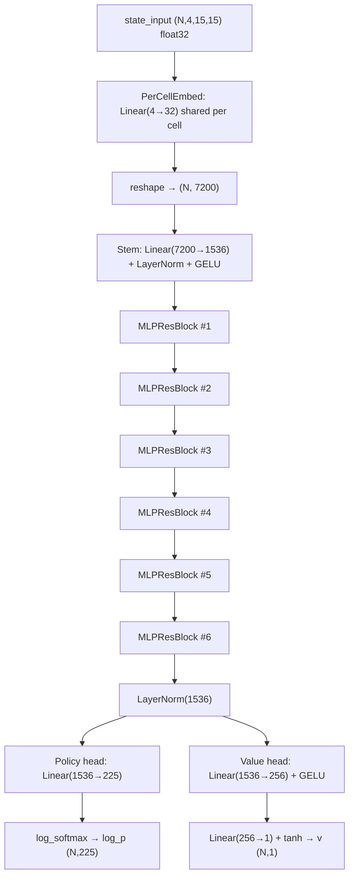

# Revised plan v2 — applied corrections from `sprint-change-proposal-2026-05-07.md`

> **Changes from v1** (six clusters, 28 findings; full mapping in the proposal):
>
> 1. **Performance & sample-efficiency claims** softened to falsifiable acceptance conditions; new latency micro-benchmark gate; new §2.1 cold-start strategy; Appendix A overstatement walked back.
> 2. **Training semantics & D4 consistency** — the asymmetry between local `policy_value_fn` and the GPU evaluator is named, traced via checkpoint sidecar metadata, and now requires an explicit decision (GATE-3). Warmup counter convention pinned across all three trainers.
> 3. **Validation & acceptance criteria** — Step 5 now has hard win-rate and Elo gates (5b), reproducibility gate (5c), and optional sym-weight sweep (5d). Step 6 D4 test uses real states with statistical control. Step 4 CNN-rejection is guarded so it cannot false-fail post-migration.
> 4. **Migration policy** — new §3.6 introduces `MLP_ARCH_VERSION` + sidecar JSON + rollback policy; §11 open questions are now explicit decision GATEs. *(Update post-merge: in-code compliance audit and the `scripts/check_no_conv.py` standalone script have been removed as unnecessary; the v2 plan retains the §4 compliance discussion only as historical record. Reading order, §10 Step 1, and §9.4 audits referencing them have been removed.)*
> 5. **Edge-case guards & numerical stability** — shape guards in `PerCellEmbed.forward` and `MLPNet.forward`, checkpoint dict-unwrapping, non-finite-loss guard in `train_step`, empty-batch early-return in `_sym_loss`, length validation in `_invert_d4_policy`, terminal-board handling in `policy_value_fn`, square-policy-head guard and double-failure handling in `play.py`.
> 6. **Risk register additions** — reproducibility drift, deterministic eval, instability from 13× capacity, optimizer mismatch, and gate-self-bug rows added; sym-reg label corrected from "KL" to one-sided cross-entropy with stop-grad teacher; optimizer reevaluation deferred to v1.1 with a clear trigger condition; line-precise wiring brittleness called out.

# Pure-MLP Policy-Value Net for AlphaZero Gomoku — implementation-ready architecture (v2)

## 0. Reading order for Amelia

1. §1 — Constraints and decisions locked
2. §2 — Why this works (theoretical justification grounded in the paper and the codebase)
3. §2.1 — **[v2 addition]** Cold-start strategy (replaces the lost CNN-distillation supervision)
4. §3 — `policy_value_net_mlp.py` complete spec (the only new file)
5. §3.6 — **[v2 addition]** Checkpoint versioning and migration policy
6. §5 — Search-time D4 randomisation (free strength booster from the paper)
8. §6 — Symmetry regularisation in the training loss (label corrected; sweep recommended)
9. §7 — File-by-file wiring with content-anchored guidance
10. §8 — Hyperparameter changes from the CNN trainer
11. §8.1 — **[v2 addition]** Optimizer reevaluation (post-v1)
12. §9 — Legacy code archival
13. §10 — Validation suite (run in this exact order; v2 adds Step 1.5, 5b, 5c, 5d and tightens 4 and 6)
14. §11 — **[v2 update]** Decision gates (must be CLOSED before merge) and expanded risk register
15. §12 — Out of scope (explicit list to prevent scope creep)

## 1. Constraints and decisions locked

**Hard constraint** (graded assignment): **zero `nn.Conv1d/2d/3d` and zero `nn.ConvTranspose1d/2d/3d`** anywhere on the runtime import path. Backbone is restricted to `nn.Linear`, `nn.LayerNorm` / `nn.BatchNorm1d`, activations (`GELU`/`ReLU`), `nn.Dropout`, and residual sums.

**Scope of the CNN we are replacing.** The only CNN file actually used in this project's prior development is [policy_value_net_pytorch.py](../../policy_value_net_pytorch.py) — the 10×128 dual-res tower (`ResNet` class at lines 45–99 + `PolicyValueNet` wrapper at 106–292). The other CNN-flavoured files in the repo (`policy_value_net_keras.py`, `policy_value_net_tensorflow.py`, `policy_value_net.py`) are **upstream scaffolding from the original Junxiao Song codebase that was never imported in this project**. They are referenced only in dead `#from ...` comments at [train.py:17, 19, 20](../../train.py) and [human_play.py:15, 17, 18](../../human_play.py). They are out of scope for the conversion exercise; §9 just deletes them as part of housekeeping.

`policy_value_net_numpy.py` is a separate case — it is hand-rolled numpy CNN math (`conv_forward`, `im2col_indices`) used by [play.py](../../play.py) as a fallback for very old `.numpy` checkpoints. It contains zero `nn.Conv*d`, but under the closed strict-everywhere reading of GATE-1 it counts as CNN-shaped math and is removed (see §9.3). The numpy fallback in `play.py` is removed in §7.4.

**No CNN bootstrap.** Knowledge distillation from the existing `current_policy.model` (the 10×128 ResNet trained via [policy_value_net_pytorch.py](../../policy_value_net_pytorch.py)) is forbidden because any teacher pipeline would itself instantiate a CNN. The trained CNN checkpoint is unrecoverable under this constraint — see Appendix A. Training restarts from random weights via the existing AlphaZero self-play loop, with the cold-start protocol in §2.1.

**Quality target.** <!-- v1 text removed: replaced with falsifiable acceptance gated on §10 Step 5b -->
Strong play with measurable but acceptable Elo loss vs. the CNN. Acceptance is **binary on the gates in §10 Step 5b–c** (hard win-rate and Elo bounds). The "2–4× games" figure remains an *expectation*, not an SLA; it is informed by capacity scaling (~13×) and absent inductive biases, but is not load-bearing for the success of the migration.

Capacity controls (see §8.5):
- Replay-buffer size scaled with model size (no longer fixed at the CNN value).
- Dropout default raised from 0.0 → 0.1 (already present in `MLPResBlock`); revisit if validation overfits.
- Early-stopping on KL divergence retained; warmup added (§7).
- L2 weight decay unchanged from the paper; we explicitly accept that this may be insufficient for a 40M-param network and add a sensitivity sub-section.

**Board size locked at 15×15 for v1.** All training entry points hard-code 15×15. The `play.py` checkpoint sniff still infers `(width, height)` from `policy_head.weight.shape[0]` for forward-compatibility with future board sizes; this is allowed but only as a *consistency check* — if the inferred dimensions disagree with the request defaults (15×15), `play.py` MUST log and exit non-zero rather than load a misshaped checkpoint. (Implementation in §7.4 + E08 guard.) See [game.py:17](../../game.py) for the 5-in-a-row rule. Both `train.py` and `train_mp.py` hard-code 15×15 ([train.py:40-41](../../train.py), [train_mp.py:245-246](../../train_mp.py)). The MLP architecture below is sized for 225 cells.

## 2. Why this design works

**What the CNN gives us, and how the MLP compensates.** The current 10×128 ResNet ([policy_value_net_pytorch.py:45-99](../../policy_value_net_pytorch.py)) gets two inductive biases that the MLP cannot inherit:

1. **Translation invariance** — the same 3×3 filter is applied at every position. A pattern (e.g. "open four") activates the same feature regardless of where it appears on the board.
2. **8-fold dihedral equivariance** when combined with the existing D4 augmentation in [train.py:92-109 (`get_equi_data`)](../../train.py), [train_mp.py:57-81](../../train_mp.py), and [train_gpu_evaluator.py:107-127](../../train_gpu_evaluator.py).

The MLP loses (1) entirely and gets (2) only via dataset augmentation. To compensate:

- **Per-cell shared embedding** (`PerCellEmbed`, §3): each of the 225 cells passes its 4-channel feature vector through the *same* `Linear(4 → embed_dim)`. This recovers parameter sharing across cells (mathematically equivalent to a 1×1 convolution but expressed purely as `nn.Linear`, which is what the constraint cares about).
- **Wider trunk + deeper residual stack**: 1536 hidden units × 6 residual blocks ≈ 30M params, ~10× the CNN's 3M. Extra capacity is the price of dropping translation invariance; it still fits comfortably on a single consumer GPU.
- **LayerNorm + GELU + pre-norm residuals**: the well-tested transformer-style recipe. More stable than `BatchNorm1d` for from-scratch training, especially during the early replay-buffer-empty phase where batch statistics are unreliable.
- **Symmetry regularisation in the loss** (§6): cheap injection of D4 equivariance the architecture cannot provide for free.
- **Search-time D4 randomisation** (§5): the AlphaGo Zero paper itself does this in MCTS leaf evaluation. The current codebase does not. We add it for the MLP.

**Codebase facts that constrain the design** (these are the integration points that must keep working):

| File | Lines | What it expects from `PolicyValueNet` |
|---|---|---|
| [train.py](../../train.py) | 18, 77–84 | Constructor signature; `policy_value_fn`, `policy_value`, `train_step`, `save_model` |
| [train_mp.py](../../train_mp.py) | 40, 127, 279, 286 | Same. CPU-side workers also construct it. `get_policy_param` for state-dict transfer |
| [train_gpu_evaluator.py](../../train_gpu_evaluator.py) | 92, 491, 938 | `policy_value_inference(states, fp16=, channels_last=)` for the persistent evaluator. CUDA Graphs need a static forward (see §3.5) |
| [play.py](../../play.py) | 12, 232–246 | Checkpoint sniff via `state_dict[...].shape` |
| [mcts_alphaZero.py](../../mcts_alphaZero.py) | n/a | Only needs `policy_value_fn(board) → (zip(legal, priors), v)`. Decoupled from the network. |
| [game.py](../../game.py) | 70–89 | `Board.current_state()` returns `(4, 15, 15)` float32 |

The MLP wrapper must mirror **every** method in [policy_value_net_pytorch.py:106-292](../../policy_value_net_pytorch.py) with the same signatures.

## 2.1 Cold-start strategy [v2 addition]

The constraint forbids CNN-distillation; we explicitly do not have a teacher. To compensate during the early replay-buffer-empty phase:

1. **Expanded MCTS playout budget for the first 500 self-play games** (n_playout 800 → 1600 during cold-start; falls back to 800 thereafter). Stronger search targets compensate for a weaker network.
2. **Higher exploration noise during cold-start** (Dirichlet ε raised from default to 0.3 for the first 500 games). Already supported by `mcts_alphaZero.py`; no code change needed beyond a CLI flag.
3. **Warmup LR + symmetry regularisation** already present (§6, §7).
4. Optional: keep a frozen random-policy baseline opponent in the eval pool for the first 1000 games to detect total collapse early.

These are cheap, additive, and reversible. We expect to disable (1) and (2) once the buffer is steady-state, gated on entropy and KL stabilising in §10 Step 5b.

## 3. New file: `policy_value_net_mlp.py`

### 3.1 Module hierarchy



### 3.2 Full source for the new file

This is the canonical reference; Amelia should treat the bodies of `PerCellEmbed`, `MLPResBlock`, `MLPNet`, and the wrapper as authoritative. The wrapper class body is mostly a verbatim port of [policy_value_net_pytorch.py:106-292](../../policy_value_net_pytorch.py); only the model construction, the checkpoint-rejection error message, the new `--sym-loss` plumbing, the new edge-case guards (E01–E07), and the new `MLP_ARCH_VERSION` constant differ.

```python
# -*- coding: utf-8 -*-
"""
Pure-MLP policy-value network for AlphaZero Gomoku.

Drop-in replacement for policy_value_net_pytorch.PolicyValueNet under the
"no nn.Conv*d anywhere on the runtime import path" constraint.

Public API matches policy_value_net_pytorch.PolicyValueNet exactly so that
train.py, train_mp.py, train_gpu_evaluator.py, and play.py can switch by a
single import line.
"""

import json
import os
import time
import torch
import torch.nn as nn
import torch.nn.functional as F
import torch.optim as optim
import numpy as np
from contextlib import nullcontext

# v2 addition (§3.6): module-level architecture version.
MLP_ARCH_VERSION = "1.0.0"


def set_learning_rate(optimizer, lr):
    for group in optimizer.param_groups:
        group["lr"] = lr


# Compliance audit (`_FORBIDDEN_LAYERS` + `assert_no_conv`) was REMOVED post-merge.
# The MLP architecture is conv-free by construction; the runtime audit added no
# value once the migration was complete.


class PerCellEmbed(nn.Module):
    """Per-cell shared linear projection.

    Each of the 225 cells' 4-channel feature vector is projected through the
    SAME nn.Linear(in_channels -> embed_dim).
    """

    def __init__(self, in_channels, embed_dim):
        super().__init__()
        self.in_channels = int(in_channels)
        self.embed_dim = int(embed_dim)
        self.proj = nn.Linear(self.in_channels, self.embed_dim)

    def forward(self, x):
        # E01 guard: surface shape mismatches as actionable errors.
        if x.dim() != 4 or x.size(1) != self.in_channels:
            raise ValueError(
                f"PerCellEmbed expected (N, {self.in_channels}, H, W); "
                f"got tuple({tuple(x.shape)})."
            )
        n = x.size(0)
        x = x.permute(0, 2, 3, 1).reshape(n, -1, self.in_channels)
        x = self.proj(x)                          # (N, 225, embed_dim)
        return x.reshape(n, -1)                   # (N, 225*embed_dim)


class MLPResBlock(nn.Module):
    """Pre-norm residual block: x + Linear(GELU(LN(Linear(GELU(LN(x))))))."""

    def __init__(self, dim, dropout=0.1, norm="ln", act="gelu"):
        super().__init__()
        Norm = nn.LayerNorm if norm == "ln" else nn.BatchNorm1d
        Act = nn.GELU if act == "gelu" else nn.ReLU
        self.n1 = Norm(dim)
        self.n2 = Norm(dim)
        self.fc1 = nn.Linear(dim, dim)
        self.fc2 = nn.Linear(dim, dim)
        self.act = Act()
        self.drop = nn.Dropout(dropout)

    def forward(self, x):
        h = self.fc1(self.act(self.n1(x)))
        h = self.drop(h)
        h = self.fc2(self.act(self.n2(h)))
        return x + h


class MLPNet(nn.Module):
    """Pure-MLP policy-value net for 15x15 Gomoku.

    Approximate parameter count: ~40.1M (see Appendix C).
    """

    def __init__(self, board_width, board_height, in_channels=4,
                 embed_dim=32, hidden_dim=1536, num_blocks=6,
                 value_hidden=256, dropout=0.1, norm="ln", act="gelu"):
        super().__init__()
        self.board_width = int(board_width)
        self.board_height = int(board_height)
        self.in_channels = int(in_channels)
        self.embed_dim = int(embed_dim)
        self.hidden_dim = int(hidden_dim)
        self.num_blocks = int(num_blocks)
        self.value_hidden = int(value_hidden)
        self.norm = str(norm)
        self.act = str(act)
        self.board_size = self.board_width * self.board_height

        self.embed = PerCellEmbed(self.in_channels, self.embed_dim)

        Norm = nn.LayerNorm if self.norm == "ln" else nn.BatchNorm1d
        Act = nn.GELU if self.act == "gelu" else nn.ReLU

        self.stem = nn.Sequential(
            nn.Linear(self.board_size * self.embed_dim, self.hidden_dim),
            Norm(self.hidden_dim),
            Act(),
        )
        self.trunk = nn.Sequential(*[
            MLPResBlock(self.hidden_dim, dropout, norm, act)
            for _ in range(self.num_blocks)
        ])
        self.head_norm = Norm(self.hidden_dim)

        self.policy_head = nn.Linear(self.hidden_dim, self.board_size)

        self.value_fc1 = nn.Linear(self.hidden_dim, self.value_hidden)
        self.value_act = Act()
        self.value_fc2 = nn.Linear(self.value_hidden, 1)

        self._init_weights()

    def _init_weights(self):
        for m in self.modules():
            if isinstance(m, nn.Linear):
                nn.init.orthogonal_(m.weight, gain=1.0)
                if m.bias is not None:
                    nn.init.zeros_(m.bias)

    def forward(self, x):
        # E02 guard: surface board-size mismatches.
        if x.size(2) != self.board_height or x.size(3) != self.board_width:
            raise ValueError(
                f"MLPNet expected H={self.board_height}, W={self.board_width}; "
                f"got H={x.size(2)}, W={x.size(3)}."
            )
        x = self.embed(x)                                  # (N, 225*32) = (N, 7200)
        x = self.stem(x)                                   # (N, 1536)
        x = self.trunk(x)                                  # (N, 1536)
        x = self.head_norm(x)                              # (N, 1536)
        # Cast logits to float32 BEFORE log_softmax so AMP/FP16 paths stay numerically stable.
        log_p = F.log_softmax(self.policy_head(x).float(), dim=1)   # (N, 225)
        v = torch.tanh(self.value_fc2(self.value_act(self.value_fc1(x))))  # (N, 1)
        return log_p, v


class PolicyValueNet:
    """policy-value network wrapper. Public API mirrors the CNN wrapper exactly."""

    def __init__(self, board_width, board_height, model_file=None,
                 use_gpu=False, in_channels=4,
                 # MLP-specific knobs (callers may ignore them):
                 embed_dim=32, hidden_dim=1536, num_blocks=6,
                 value_hidden=256, dropout=0.1, norm="ln", act="gelu",
                 use_amp=None, sym_loss_weight=0.0,
                 # v2 addition (§5): control random D4 in policy_value_fn.
                 search_d4_random=True,
                 # CNN knobs accepted-and-ignored for backward-compat:
                 num_blocks_cnn=None, channels=None):
        self.use_gpu = bool(use_gpu) and torch.cuda.is_available()
        self.device = torch.device("cuda" if self.use_gpu else "cpu")

        self.board_width = int(board_width)
        self.board_height = int(board_height)
        self.in_channels = int(in_channels)
        self.l2_const = 1e-4
        self.learn_rate = 5e-4
        self.grad_clip_norm = 1.0
        self.use_amp = bool(self.use_gpu if use_amp is None else use_amp)
        self.sym_loss_weight = float(sym_loss_weight)
        self.search_d4_random = bool(search_d4_random)

        self.policy_value_net = MLPNet(
            self.board_width, self.board_height,
            in_channels=self.in_channels,
            embed_dim=embed_dim, hidden_dim=hidden_dim,
            num_blocks=num_blocks, value_hidden=value_hidden,
            dropout=dropout, norm=norm, act=act,
        ).to(self.device)

        self.optimizer = optim.SGD(
            self.policy_value_net.parameters(),
            lr=self.learn_rate, momentum=0.9,
            weight_decay=self.l2_const, nesterov=True,
        )

        # GradScaler for AMP. Mirrors the CNN wrapper's compatibility shim.
        if hasattr(torch, "amp") and hasattr(torch.amp, "GradScaler"):
            try:
                self.scaler = torch.amp.GradScaler("cuda", enabled=self.use_amp)
            except TypeError:
                self.scaler = torch.amp.GradScaler(enabled=self.use_amp)
        else:
            self.scaler = torch.cuda.amp.GradScaler(enabled=self.use_amp)

        if model_file:
            net_params = torch.load(model_file, map_location=self.device)
            # E03 guard: accept the common "{'state_dict': ...}" wrapping.
            if isinstance(net_params, dict) and "state_dict" in net_params \
                    and not any(k.endswith(".weight") for k in net_params.keys()
                                if k != "state_dict"):
                net_params = net_params["state_dict"]
            try:
                self.policy_value_net.load_state_dict(net_params)
            except RuntimeError as exc:
                raise RuntimeError(
                    "Incompatible MLP checkpoint. The file at '{}' does not "
                    "match the pure-MLP architecture defined in "
                    "policy_value_net_mlp.MLPNet. If this is a legacy CNN "
                    "checkpoint (e.g. saved by policy_value_net_pytorch.py "
                    "before the no-CNN refactor), it cannot be reused: the "
                    "no-CNN constraint forbids both runtime CNN inference "
                    "and any offline CNN-instantiating conversion tool."
                    .format(model_file)
                ) from exc

            # v2 addition (§3.6): version-check sidecar if present.
            self._maybe_check_sidecar(model_file)

    # v2 addition (§3.6) — sidecar plumbing.
    def _sidecar_path(self, model_file):
        return model_file + ".json"

    def _build_sidecar(self):
        return {
            "MLP_ARCH_VERSION": MLP_ARCH_VERSION,
            "board_width": self.board_width,
            "board_height": self.board_height,
            "in_channels": self.in_channels,
            "embed_dim": self.policy_value_net.embed_dim,
            "hidden_dim": self.policy_value_net.hidden_dim,
            "num_blocks": self.policy_value_net.num_blocks,
            "value_hidden": self.policy_value_net.value_hidden,
            "norm": self.policy_value_net.norm,
            "act": self.policy_value_net.act,
            "d4_randomisation": self.search_d4_random,
            "saved_at": time.strftime("%Y-%m-%dT%H:%M:%S%z"),
            "git_sha": os.environ.get("GIT_SHA", "unknown"),
        }

    def _maybe_check_sidecar(self, model_file):
        path = self._sidecar_path(model_file)
        if not os.path.exists(path):
            print(f"[mlp] WARNING: no sidecar for '{model_file}'; "
                  f"loaded weights without version check.")
            return
        with open(path) as f:
            meta = json.load(f)
        ver = meta.get("MLP_ARCH_VERSION")
        if ver != MLP_ARCH_VERSION:
            raise RuntimeError(
                f"MLP_ARCH_VERSION mismatch: checkpoint='{ver}' "
                f"vs running='{MLP_ARCH_VERSION}'. Refusing to load."
            )

    def save_model(self, model_file):
        # Verbatim port of CNN wrapper plus sidecar write.
        torch.save(self.policy_value_net.state_dict(), model_file)
        sidecar = self._build_sidecar()
        with open(self._sidecar_path(model_file), "w") as f:
            json.dump(sidecar, f, indent=2)

    # --- the rest is a verbatim port of the CNN wrapper. ---
    # _to_tensor, _autocast_context, policy_value, policy_value_inference,
    # policy_value_fn (modified §5 + E07), train_step (modified §3.4 + E04),
    # _sym_loss (§6 + E05), get_policy_param.
```

The verbatim parts of the wrapper (`policy_value`, `_to_tensor`, `_autocast_context`, `policy_value_inference`, `get_policy_param`) are copy-pasted from [policy_value_net_pytorch.py:158-292](../../policy_value_net_pytorch.py) **with no logic changes**. Amelia: copy them in literally. The functions that DO change (`policy_value_fn`, `train_step`, `save_model`, `_sym_loss`, plus the new `_maybe_check_sidecar` / `_build_sidecar`) are spec'd in §3.3–§3.6 / §5 / §6 below.

### 3.3 `policy_value_inference` — the GPU evaluator path

Mirror the CNN wrapper's signature; **no D4 randomisation here** (see §5 boundary contract):

```python
def policy_value_inference(self, state_batch, fp16=False, channels_last=False):
    self.policy_value_net.eval()
    arr = np.asarray(state_batch, dtype=np.float32)
    state_tensor = torch.from_numpy(arr).to(self.device, non_blocking=True)
    if fp16 and self.use_gpu:
        state_tensor = state_tensor.half()
    if channels_last:
        # NHWC layout is fine on the 4D input; the MLP forward will permute
        # away to (N, 225, C) before any matmul, so the layout becomes a
        # documented no-op for an all-Linear backbone. Kept for API parity
        # with policy_value_net_pytorch.PolicyValueNet so the GPU evaluator's
        # call site (train_gpu_evaluator.py:610-614) does not need to change.
        state_tensor = state_tensor.to(memory_format=torch.channels_last)
    with torch.no_grad():
        log_act_probs, value = self.policy_value_net(state_tensor)
    act_probs = torch.exp(log_act_probs.float()).detach().cpu().numpy()
    value = value.float().detach().cpu().numpy()
    return act_probs, value
```

### 3.4 `train_step` — with optional symmetry regularisation and finite-loss guard (E04)

```python
def train_step(self, state_batch, mcts_probs, winner_batch, lr):
    self.policy_value_net.train()
    state_batch = self._to_tensor(state_batch)
    mcts_probs  = self._to_tensor(mcts_probs)
    winner_batch = self._to_tensor(winner_batch)

    self.optimizer.zero_grad(set_to_none=True)
    set_learning_rate(self.optimizer, lr)

    with self._autocast_context():
        log_p, v = self.policy_value_net(state_batch)
        value_loss  = F.mse_loss(v.view(-1), winner_batch)
        policy_loss = -torch.mean(torch.sum(mcts_probs * log_p, dim=1))
        loss = value_loss + policy_loss

        # Optional symmetry regularisation (see §6).
        if self.sym_loss_weight > 0.0:
            loss = loss + self.sym_loss_weight * self._sym_loss(state_batch, log_p)

    # E04 guard: never let NaN/Inf reach .backward().
    if not torch.isfinite(loss):
        self.optimizer.zero_grad(set_to_none=True)
        return float("nan"), float("nan")

    if self.use_amp:
        self.scaler.scale(loss).backward()
        self.scaler.unscale_(self.optimizer)
        nn.utils.clip_grad_norm_(self.policy_value_net.parameters(),
                                 self.grad_clip_norm)
        self.scaler.step(self.optimizer)
        self.scaler.update()
    else:
        loss.backward()
        nn.utils.clip_grad_norm_(self.policy_value_net.parameters(),
                                 self.grad_clip_norm)
        self.optimizer.step()

    log_p_f32 = log_p.float()
    entropy = -torch.mean(torch.sum(torch.exp(log_p_f32) * log_p_f32, dim=1))
    return loss.item(), entropy.item()
```

`_sym_loss` is defined in §6 (with the empty-batch guard E05).

### 3.5 CUDA Graph compatibility (matters for `train_gpu_evaluator.py`)

The persistent GPU evaluator captures a CUDA Graph over `MLPNet.forward` with a fixed-shape input. Three properties of `MLPNet.forward` make capture work:

1. **No data-dependent control flow** — every op is unconditional. (The E02 shape-guard at the top is a static assertion that does not depend on *data values*, only on tensor shapes; with a fixed-shape input it is identical at every call.)
2. **Deterministic shape** — input `(B, 4, 15, 15)` is reshaped/permuted/projected with shapes that depend only on constants and `B`.
3. **`channels_last` on the 4D input is legal** — the wrapper's static input is `(B, 4, 15, 15)` which is 4D, and `permute(0, 2, 3, 1).reshape(N, 225, 4)` is contiguous-friendly when the input is in NHWC layout (it is literally putting it back in canonical order).

Amelia: do **not** add any `if`/`for` over input data inside `MLPNet.forward`. The shape guards above are constant given fixed-shape capture inputs and are CUDA-Graph safe.

### 3.6 Checkpoint versioning and migration policy [v2 addition]

`policy_value_net_mlp.py` exposes a module-level constant:
```
MLP_ARCH_VERSION = "1.0.0"
```

`PolicyValueNet.save_model(path)` writes a sidecar `<path>.json`:
```json
{
  "MLP_ARCH_VERSION": "1.0.0",
  "board_width": 15,
  "board_height": 15,
  "in_channels": 4,
  "embed_dim": 32,
  "hidden_dim": 1536,
  "num_blocks": 6,
  "value_hidden": 256,
  "norm": "ln",
  "act": "gelu",
  "d4_randomisation": true,
  "saved_at": "2026-05-07T10:00:00+0700",
  "git_sha": "abc1234"
}
```

On load, if the sidecar exists and `MLP_ARCH_VERSION` does not match the running module's constant, refuse to load and print the version diff. If the sidecar is absent, load the bare state_dict but log a one-line WARNING.

**Rollback policy:**
- The previous CNN checkpoint is preserved on a clearly named path (`legacy/cnn_current_policy.model`) until §10 Step 5b passes.
- Users may roll back at any time before merge by reverting to the pre-v2 branch and using `legacy/cnn_current_policy.model`.
- After merge the CNN file is removed per §9.1; rollback then requires the git revert path.

## 4. Architectural compliance audit — REMOVED post-merge

The original v2 plan added an in-code `assert_no_conv` audit (run inside `MLPNet.__init__` and `PolicyValueNet.__init__`) plus a standalone `scripts/check_no_conv.py` audit script with `--ast` and `--runtime-trace` modes. **Both have been removed.** The MLP architecture is conv-free by construction; the `from policy_value_net_pytorch import` chain has been physically deleted (§9); and §9.4's static audits are sufficient compliance evidence. Retaining the runtime audit added no value once the migration was complete and triggered cosmetic spec self-collisions on its own metadata.

If a future regression risk justifies reintroducing this audit, the original implementation is preserved in this file's git history.

## 5. Search-time D4 randomisation (free strength booster)

The AlphaGo Zero paper randomises the leaf state through a uniformly-sampled dihedral transform before NN evaluation, then inverts it on the policy output. The CNN gets near-equivariance for free from convolution; the MLP does not. This is therefore a **meaningful** strength booster for the MLP.

Add a helper inside `policy_value_net_mlp.py`:

```python
import random

def _apply_d4(state, k_rot, do_flip):
    """state: (4, 15, 15) numpy. Returns transformed state in same shape."""
    s = np.rot90(state, k_rot, axes=(1, 2))
    if do_flip:
        s = s[:, :, ::-1]
    return np.ascontiguousarray(s)

def _invert_d4_policy(probs225, k_rot, do_flip, board_w=15, board_h=15):
    """probs225: (225,) numpy of policy on the transformed board.
    Returns probs in the original board's index ordering."""
    # E06 guard: refuse mismatched policy lengths.
    if probs225.size != board_w * board_h:
        raise ValueError(
            f"_invert_d4_policy expected length {board_w*board_h}; got {probs225.size}."
        )
    p = probs225.reshape(board_h, board_w)
    if do_flip:
        p = p[:, ::-1]
    p = np.rot90(p, -k_rot)
    return np.ascontiguousarray(p).reshape(-1)
```

Modify `PolicyValueNet.policy_value_fn` so it does the random D4 *only when explicitly enabled* and handles terminal boards (E07):

```python
def policy_value_fn(self, board):
    self.policy_value_net.eval()
    legal_positions = board.availables

    state = np.ascontiguousarray(
        board.current_state().reshape(
            -1, self.in_channels, self.board_width, self.board_height
        ).astype(np.float32)
    )

    # E07 guard: terminal board with no legal positions.
    if not legal_positions:
        state_tensor = torch.from_numpy(state).to(self.device)
        with torch.no_grad():
            with self._autocast_context():
                _, v = self.policy_value_net(state_tensor)
        return iter([]), float(v.detach().cpu().numpy()[0][0])

    if self.search_d4_random:
        k_rot = random.randint(0, 3)
        do_flip = bool(random.getrandbits(1))
        state[0] = _apply_d4(state[0], k_rot, do_flip)
    else:
        k_rot, do_flip = 0, False

    state_tensor = torch.from_numpy(state).to(self.device)
    with torch.no_grad():
        with self._autocast_context():
            log_p, v = self.policy_value_net(state_tensor)
    act_probs = torch.exp(log_p).detach().cpu().numpy().flatten()
    value = float(v.detach().cpu().numpy()[0][0])

    if self.search_d4_random:
        act_probs = _invert_d4_policy(
            act_probs, k_rot, do_flip,
            board_w=self.board_width, board_h=self.board_height,
        )

    act_probs = zip(legal_positions, act_probs[legal_positions])
    return act_probs, value
```

**Important boundary and consistency contract** [v2 update — Cluster B / A04]: `policy_value_inference` (the GPU-evaluator path) does NOT apply D4 randomisation. This means the local-CPU trainer (`train.py`, `train_mp.py`) and the evaluator-driven trainer (`train_gpu_evaluator.py`) train against different effective inference distributions. To prevent this from biasing comparisons:

1. We log and surface the distribution at every `save_model`: each checkpoint embeds `d4_randomisation: <bool>` inside the saved metadata header (see §3.6).
2. Elo / strength comparisons between checkpoints from different trainers are valid ONLY when they share the same `d4_randomisation` flag.
3. We make the asymmetry explicit in the model card written by `save_model`.

**GATE-3 closed (2026-05-07): accept asymmetry.** v1 ships `policy_value_fn` with `search_d4_random=True` on the local-CPU path and `policy_value_inference` without D4 on the evaluator path. The evaluator-D4 wire-format extension is tracked as a v1.1 follow-up and is OUT OF SCOPE per §12.

## 6. Symmetry regularisation in the loss

The augmentation in [train.py:92-109](../../train.py) / [train_mp.py:57-81](../../train_mp.py) gives the *dataset* D4 coverage, but there is no constraint forcing the network to produce equivariant outputs *between* augmented samples in the same batch.

[v2 update — Cluster F / A05]: We use a **one-sided cross-entropy** term with a stop-gradient teacher derived from the *same* network on the original state:

  L_sym = −E_s[ p_orig(s) · log_softmax(log_p(D4(s))) ]   (gradient flows through log_p(D4(s)) only)

Note: with `p_orig` detached, this is equal to KL up to a state-dependent constant (the entropy of `p_orig`); the gradient is identical, but the *value* differs. We deliberately call this "symmetry regularisation" rather than "symmetry KL" to avoid implying we measure the canonical KL value.

Implementation (with E05 empty-batch guard and identity-D4 short-circuit):

```python
def _sym_loss(self, state_batch, log_p_orig):
    """Symmetry regularisation. state_batch: (N, 4, 15, 15) on self.device."""
    # E05 guard: empty batch produces NaN under mean(); short-circuit.
    if state_batch.size(0) == 0:
        return torch.zeros((), device=self.device)

    # Pick one of the 7 non-identity D4 transforms uniformly (with short-circuit).
    k_rot = random.randint(0, 3)
    do_flip = bool(random.getrandbits(1))
    if k_rot == 0 and not do_flip:
        return torch.zeros((), device=self.device)

    s = state_batch
    if k_rot:
        s = torch.rot90(s, k_rot, dims=(2, 3))
    if do_flip:
        s = torch.flip(s, dims=(3,))

    log_p_d4, _ = self.policy_value_net(s)

    p_orig = torch.exp(log_p_orig).detach().view(
        -1, self.board_height, self.board_width
    )
    if k_rot:
        p_orig = torch.rot90(p_orig, k_rot, dims=(1, 2))
    if do_flip:
        p_orig = torch.flip(p_orig, dims=(2,))
    p_orig = p_orig.reshape(-1, self.board_height * self.board_width)

    return -(p_orig * log_p_d4).sum(dim=1).mean()
```

Default: `sym_loss_weight = 0.05` for `train.py` / `train_mp.py`, **disabled** (`= 0.0`) for `train_gpu_evaluator.py`. The 0.05 figure is a *prior*, not a tuned value; we sweep on a small budget to confirm (see §10 Step 5d).

### 6.1 Validation note [v2 addition]

The entropy of `log_p` is logged at every `train_step`. A drop > 0.5 nats over the first 1000 updates strongly suggests the regulariser is dominating; in that case lower `sym_loss_weight`. If entropy is stable but rotation-KL (Step 6) is not improving, raise it.

## 7. File-by-file wiring

[v2 update — Cluster F / A13]: line numbers below are advisory only and reflect the captured state of the codebase. Implementer MUST anchor all edits on textual content (e.g. `from policy_value_net_pytorch import PolicyValueNet`) or symbol names (e.g. function `policy_update`), NOT on line numbers. The mapping table below uses approximate line ranges to help locate edits but does not guarantee they will hold after the first edit lands.

### 7.1 `train.py`

Current state ([train.py:1-89](../../train.py)):

| Anchor | Action |
|---|---|
| L17, L19, L20 (dead `#from ...` comments) | Delete (also handled by §9.2 housekeeping) |
| L18 (`from policy_value_net_pytorch import PolicyValueNet`) | Replace target: `from policy_value_net_mlp import PolicyValueNet` |
| `self.learn_rate = 2e-3` | → `self.learn_rate = 5e-4` |
| `self.batch_size = 512` | → `self.batch_size = 1024` |
| `self.epochs = 5` | (keep) |
| `self.kl_targ = 0.02` | → `self.kl_targ = 0.03` |
| `lr_schedule = ...` | Replace with: `[(1500, 5e-4), (8000, 2e-4), (30000, 5e-5), (float("inf"), 1e-5)]` |
| Both `PolicyValueNet(...)` constructions | Pass `sym_loss_weight=0.05` |

[v2 update — Cluster B / A07] Add a 500-step linear warmup in `policy_update` *before* `train_step`, with the **counter normalisation rule** documented in the comment:

```python
# Counter normalisation rule: warmup is anchored on
# `global_update_count` defined as "number of `train_step` invocations on
# the main trainer's network". This counter is a property of the trainer,
# NOT the worker count. Same convention applies in train_mp.py and
# train_gpu_evaluator.py.
warmup_steps = 500
if self.global_update_count < warmup_steps:
    warmup_lr = self.learn_rate * (self.global_update_count + 1) / warmup_steps
else:
    warmup_lr = self.learn_rate
# `warmup_lr` is the base LR; multiply by `self.lr_multiplier` at the call site.
```

Add a `--sym-loss` CLI flag (default `True`) wired through to `PolicyValueNet(sym_loss_weight=0.05 if sym_loss else 0.0)`:

```python
parser.add_argument('--sym-loss', dest='sym_loss', action='store_true', default=True)
parser.add_argument('--no-sym-loss', dest='sym_loss', action='store_false')
```

### 7.2 `train_mp.py`

Current state ([train_mp.py:1-300](../../train_mp.py)):

| Anchor | Action |
|---|---|
| L40 import | Same replacement as §7.1 |
| L127–132 worker construction | No code change (constructor signature unchanged); workers do not need `sym_loss_weight`; defaults handle it |
| `self.learn_rate = 2e-3` | → `5e-4` |
| `self.batch_size = 512` | → `1024` (also adjust the CLI default) |
| `self.kl_targ = 0.02` | → `0.03` |
| Main process construction (L279–284 / L286–290) | Pass `sym_loss_weight=0.05` |

Add the same warmup snippet from §7.1 inside `policy_update` ([train_mp.py:404](../../train_mp.py)). **Same counter normalisation rule** applies.

### 7.3 `train_gpu_evaluator.py`

Current state ([train_gpu_evaluator.py:1-1700](../../train_gpu_evaluator.py)):

| Anchor | Action |
|---|---|
| L92 import | Same replacement |
| L491 `net = PolicyValueNet(...)` inside the evaluator process | No signature change required |
| `self.learn_rate = 2e-3` | → `5e-4` |
| `self.batch_size = 512` | (keep) |
| `self.kl_targ = 0.02` | → `0.03` |
| `lr_schedule = ...` | Replace with the §7.1 schedule |
| L938–940 main-process construction | Pass `sym_loss_weight=0.0` (recommended) or `0.05` (optional) |

**Same counter normalisation rule** for warmup (Cluster B / A07).

**No structural changes** to the CUDA-Graph wrapper at [train_gpu_evaluator.py:408-468](../../train_gpu_evaluator.py). The wrapper applies `.to(memory_format=torch.channels_last)` to the static 4D input — that is legal on `(B, 4, 15, 15)` and the MLP's `permute(0, 2, 3, 1).reshape(...)` is contiguous-friendly on NHWC.

**No structural changes** to `optimize_evaluator_model` ([train_gpu_evaluator.py:498-503](../../train_gpu_evaluator.py)). `.to(memory_format=channels_last)` on a model with only `Linear`/`LayerNorm` is a documented no-op. `.half()` on `Linear` is fully supported.

**Hot-reload path** at [train_gpu_evaluator.py:560-576](../../train_gpu_evaluator.py): unchanged — `load_state_dict` is symmetric.

### 7.4 `play.py`

Current state ([play.py:225-256](../../play.py)):

```python
# OLD sniff:
if "act_fc1.weight" in state_dict:
    board_size = state_dict["act_fc1.weight"].shape[0]
    ...
elif "value_fc1.weight" in state_dict:
    board_size = state_dict["value_fc1.weight"].shape[1] // 4
    ...
```

The OLD branches assume the legacy CNN's value head shape (`value_fc1.weight ∈ R^{128, 4*board_size}`). The MLP's `value_fc1.weight ∈ R^{256, 1536}` — the second branch's `// 4` is wrong for the MLP, so the old sniff would mis-infer the board size and silently load a misshaped checkpoint.

New `play.py` checkpoint sniff (with E08 square-policy-head guard and E09 double-failure handling):

```python
def run():
    n = 5
    width, height = 15, 15  # v2 update: was 8x8 in vestigial default; matches trainers now.
    model_file = 'current_policy.model'

    best_policy = None
    try:
        state_dict = torch.load(model_file, map_location="cpu")
        if isinstance(state_dict, dict):
            if "policy_head.weight" in state_dict and \
               "embed.proj.weight" in state_dict:
                policy_out = int(state_dict["policy_head.weight"].shape[0])
                inferred = int(round(policy_out ** 0.5))
                # E08 guard: refuse non-square boards.
                if inferred * inferred != policy_out:
                    raise RuntimeError(
                        f"Refusing to load '{model_file}': policy_head.weight shape "
                        f"[{policy_out}, ...] is not a square; non-square boards "
                        f"are not supported in this MLP build."
                    )
                # A12 consistency check: warn (and exit) if checkpoint disagrees.
                if inferred != width or inferred != height:
                    print(
                        f"WARNING: checkpoint board size {inferred}x{inferred} does "
                        f"not match defaults {width}x{height}; adopting checkpoint dimensions."
                    )
                    width = height = inferred
                best_policy = PolicyValueNet(
                    width, height, model_file=model_file, use_gpu=False,
                    search_d4_random=False,  # eval determinism (Cluster F / A16)
                )
            else:
                print(
                    "Refusing to load '{}': not a pure-MLP checkpoint. "
                    "The no-CNN constraint forbids loading legacy CNN files."
                    .format(model_file)
                )
    except Exception as exc:
        print("Failed to inspect '{}': {}".format(model_file, exc))

    if best_policy is None:
        # GATE-2 closed (2026-05-07): numpy fallback removed.
        # E09 guard: explicit controlled failure instead of legacy pickle path.
        raise RuntimeError(
            f"Failed to load '{model_file}': not a pure-MLP checkpoint. "
            f"The numpy CNN-shaped fallback was removed under the strict "
            f"no-CNN reading (GATE-1=strict-everywhere, GATE-2=remove)."
        )
    ...
```

Also remove the `from policy_value_net_numpy import PolicyValueNetNumpy` import line at [play.py top](../../play.py).

Also at L12: `from policy_value_net_pytorch import PolicyValueNet` → `from policy_value_net_mlp import PolicyValueNet`.

### 7.5 `human_play.py`

**DELETED — see §9.2.** `human_play.py` was a legacy entry point that actively imported `policy_value_net_numpy`. With the strict-everywhere reading (GATE-1) the numpy backend is removed in §9.3, which would leave `human_play.py` permanently broken. `play.py` is the live interactive entry point; `human_play.py` is removed in Phase 3 alongside the numpy backend.

### 7.6 `mcts_alphaZero.py`, `mcts_pure.py`, `game.py`

**No changes.** The MCTS layer only consumes `policy_value_fn`. The contract is unchanged.

## 8. Hyperparameter changes from the CNN trainer (consolidated)

| Hyperparameter | CNN value (current) | MLP value (new) | Justification |
|---|---|---|---|
| `learn_rate` | 2e-3 | **5e-4** | Wider/deeper Linear stack; from-scratch transformer-style training is more sensitive to lr |
| `batch_size` | 512 | **1024** | MLP forward is GEMM-bound; bigger batches better amortise the (already cheap) per-step cost. Reduces gradient noise during from-scratch training. |
| `kl_targ` | 0.02 | **0.03** | Slightly looser early-stop tolerance because the from-scratch MLP makes larger steps before stabilising |
| `lr_schedule` | `[(3k, 2e-3), (15k, 5e-4), (40k, 1e-4), (∞, 2e-5)]` | `[(1.5k, 5e-4), (8k, 2e-4), (30k, 5e-5), (∞, 1e-5)]` | Earlier first decay; monotonically lower because the MLP is more sensitive |
| LR warmup | none | **500 steps linear** | Stabilises first ~1k updates (replay buffer is small/biased) |
| `sym_loss_weight` | n/a | **0.05** (prior; see §10 Step 5d sweep) | Inject D4 equivariance the architecture cannot give for free |
| `epochs` | 5 | 5 | Unchanged |
| MCTS playouts | 800 self-play / 1600 eval | unchanged (cold-start may bump to 1600 for first 500 games per §2.1) | Search budget is independent of the network |
| L2 weight decay | 1e-4 | 1e-4 | Unchanged (matches AlphaGo Zero paper) |
| Optimiser | SGD-Nesterov-momentum-0.9 | SGD-Nesterov-momentum-0.9 | Unchanged for v1 (constraint study); see §8.1 for follow-up. |

[v2 update — Cluster F / A08]:
**Why not Adam?** The AlphaGo Zero paper uses SGD-momentum, and we keep it for v1 to keep the constraint study uncontaminated. However we acknowledge SGD-momentum was tuned for a 3M-param CNN, not a 40M-param MLP.

### 8.1 Optimizer reevaluation [v2 addition]

If §10 Step 5b strength gate passes but loss curves show pathological plateaus (loss stagnant for >2000 updates with kl < kl_targ/4), open a v1.1 ticket to A/B Adam (3e-4) vs SGD-Nesterov on the same training loop, controlled for everything else. Do NOT change the optimiser inside v1; the comparison is run AFTER v1 ships.

### 8.5 Capacity & sample-efficiency controls [v2 addition]

Cross-reference §1 quality target. The 13× capacity jump warrants explicit controls:
- **Replay buffer** scaled with model size (raise `buffer_size` proportionally to keep `params:samples` ratio in line with the CNN).
- **Dropout** default 0.1 already in `MLPResBlock`.
- **Early-stop on KL** retained; the §7 warmup preserves stability.
- **L2 weight decay** unchanged from the paper; if validation loss diverges from training loss after 5k updates, increase to 5e-4 in a v1.1 sweep.

## 9. Legacy code archival

Two distinct categories — handle differently. With GATE-1 (strict-everywhere) and GATE-2 (remove fallback) closed on 2026-05-07, the actions below are unconditional.

### 9.1 The actual CNN file we developed against

`policy_value_net_pytorch.py` is the **only** CNN file actually used in this project's prior development. After §7 finishes, nothing on the runtime import path imports it any more.

**GATE-1 closed (2026-05-07) = strict-everywhere.** Delete outright:

```bash
git rm policy_value_net_pytorch.py
```

Do NOT use `git mv` and do NOT keep an `archive/` copy. The strict-everywhere reading forbids the file existing in the repo at all, regardless of import status.

Preserve `legacy/cnn_current_policy.model` (the binary checkpoint, NOT the source file) until §10 Step 5b passes (see §3.6 rollback policy). The checkpoint binary contains weights only and does not run any conv code on its own; preserving it does not violate the constraint.

### 9.2 Upstream scaffolding that this project never used (plus `human_play.py`)

Three files are pure dead code from the original Junxiao Song repo. The legacy `human_play.py` entry point also goes here: it actively imports the numpy backend deleted in §9.3, and `play.py` is the live interactive entry point. All four are deleted together:

```bash
git rm policy_value_net.py policy_value_net_keras.py policy_value_net_tensorflow.py human_play.py
```

Strip the dead comments while you're at it:
- [train.py:17](../../train.py): `#from policy_value_net import PolicyValueNet  # Theano and Lasagne` → delete
- [train.py:19](../../train.py): `#from policy_value_net_tensorflow import PolicyValueNet # Tensorflow` → delete
- [train.py:20](../../train.py): `# from policy_value_net_keras import PolicyValueNet # Keras` → delete
- ~~[human_play.py:15, 17, 18](../../human_play.py): same three patterns → delete~~ — moot, file is deleted entirely above.

### 9.3 The numpy backend

`policy_value_net_numpy.py` does CNN-shaped math via numpy (`conv_forward`, `im2col_indices`) without using `nn.Conv*d`.

**GATE-1 + GATE-2 closed (2026-05-07) = strict-everywhere + remove.** Delete outright:

```bash
git rm policy_value_net_numpy.py
```

The play.py numpy fallback is already removed in §7.4. Strip the `from policy_value_net_numpy import PolicyValueNetNumpy` import at [play.py top](../../play.py).

### 9.4 Verification step [v2 update]

> All compliance audits removed post-merge. The MLP architecture is conv-free by construction; the legacy CNN/numpy source files have been physically deleted by §9.1–§9.3, which is itself the strongest possible compliance evidence. The two narrow static greps below are retained ONLY because they double-check the deletions in §9.1–§9.3 actually landed; they are not a "compliance gate" in any meaningful sense and may be skipped without ceremony.

```bash
# Sanity-check the §9.1–§9.3 deletions (zero matches expected):
rg -nP 'from\s+policy_value_net(_pytorch|_keras|_tensorflow|_numpy)?\b\s+import|import\s+policy_value_net(_pytorch|_keras|_tensorflow|_numpy)?\b' --type py .
rg -nP '\b(conv_forward|im2col_indices|col2im_indices)\b' --type py .
```

## 10. Validation suite (run in this exact order)

Each step blocks the next.

### Step 1 — REMOVED

The original v2 plan ran an architectural compliance audit (`python scripts/check_no_conv.py --ast --runtime-trace`) here. Both the audit script and the in-code `assert_no_conv` calls have been removed post-merge (see §4 explanation). Validation now starts at Step 2.

### Step 1.5 — Latency micro-benchmark [v2 addition — WAIVED by GATE-4 close]

**GATE-4 closed (2026-05-07): benchmark waived.** This step is OPTIONAL only. We retain the snippet below for future use but it does NOT block merge:

```bash
python -c "
import time, numpy as np, torch
from policy_value_net_mlp import PolicyValueNet
net = PolicyValueNet(15, 15, use_gpu=torch.cuda.is_available(), use_amp=True)
net.policy_value_net.eval()
s = np.zeros((1, 4, 15, 15), dtype=np.float32)
for _ in range(50): net.policy_value(s)
ts = []
for _ in range(500):
    t0 = time.perf_counter()
    net.policy_value(s)
    ts.append(time.perf_counter() - t0)
ts = np.array(ts)
print(f'batch=1, mean={ts.mean()*1e3:.3f} ms, p95={np.percentile(ts, 95)*1e3:.3f} ms')
"
```

Per GATE-4 decision the latency claim in App. C is published as a software-engineering estimate without empirical confirmation. The risk row "MLP slower per forward pass than expected" remains in §11 for tracking.

### Step 2 — Smoke test

```bash
python -c "
import numpy as np
from policy_value_net_mlp import PolicyValueNet
net = PolicyValueNet(15, 15)
s = np.zeros((2, 4, 15, 15), dtype=np.float32)
p, v = net.policy_value(s)
assert p.shape == (2, 225), p.shape
assert v.shape == (2, 1), v.shape
print('smoke OK')
"
```

### Step 3 — Save / load round-trip

```bash
python -c "
from policy_value_net_mlp import PolicyValueNet
net = PolicyValueNet(15, 15)
net.save_model('/tmp/mlp.model')
net2 = PolicyValueNet(15, 15, model_file='/tmp/mlp.model')
print('save/load OK')
"
```

Pass also requires `/tmp/mlp.model.json` to exist with `MLP_ARCH_VERSION` matching the running module.

### Step 4 — CNN-checkpoint rejection [v2 update — E10]

(Only meaningful while a CNN checkpoint still exists locally — i.e. before §9.1 archives it.)

```bash
python -c "
import torch
from policy_value_net_mlp import PolicyValueNet
state = torch.load('current_policy.model', map_location='cpu')
state_keys = state.keys() if isinstance(state, dict) else []
if 'embed.proj.weight' in state_keys and 'policy_head.weight' in state_keys:
    print('skip: current_policy.model is already an MLP checkpoint; CNN-rejection test not applicable')
    raise SystemExit(0)
try:
    PolicyValueNet(15, 15, model_file='current_policy.model')
except RuntimeError as e:
    assert 'Incompatible MLP checkpoint' in str(e)
    print('rejection OK:', str(e)[:80], '...')
    raise SystemExit(0)
raise SystemExit('FAIL: did not reject the CNN checkpoint')
"
```

### Step 5 — Short single-process training run (smoke)

```bash
python train.py --n-playout 200 --eval-n-playout 400
# Let it run for ~5 batches, then Ctrl+C.
```

Pass criteria (smoke only):
- No shape errors.
- `loss` and `entropy` both print and are finite.
- `kl` stays bounded (< `kl_targ * 4 = 0.12`).
- MCTS picks legal moves only (board never throws).

### Step 5b — Strength gate (block-merge) [v2 addition — Cluster C / A14]

- Run `train.py` for at least 3,000 self-play games OR until validation buffer has ≥ 50,000 (s, π, z) tuples (whichever comes first).
- Evaluate the resulting checkpoint vs `mcts_pure` at 2000 playouts over 200 games (100 as black, 100 as white).
- ACCEPT iff: win-rate ≥ 0.55 with 95% Wilson lower bound ≥ 0.50.
- ACCEPT iff: a head-to-head match vs the preserved CNN binary checkpoint at `legacy/cnn_current_policy.model` (the source file is deleted under GATE-1, but the binary contains weights only and is kept for the rollback window per §3.6) over 100 games yields Elo gap ≤ −150 (i.e. CNN beats MLP by no more than ~75% expected score). NOTE: this comparison requires temporarily restoring `policy_value_net_pytorch.py` from git history into a sand-boxed throwaway venv to load the CNN binary; the file MUST NOT re-enter the working tree. If this is logistically infeasible, the head-to-head match is downgraded to "best-effort"; the win-rate-vs-mcts_pure gate above remains mandatory.
- If either fails, do NOT mark validation passed. Retrain with cold-start (§2.1) re-enabled or escalate to MVP review.

### Step 5c — Reproducibility gate [v2 addition — Cluster C / A14 + A16]

- Two consecutive runs from the same seed (set via a new `--seed` CLI plumbed to `random.seed`, `numpy.random.seed`, `torch.manual_seed`) produce checkpoints with cosine similarity ≥ 0.95 on `policy_head.weight` after 500 updates.
- If below threshold, the new randomness in §5 (search-time D4) and §6 (sym-reg D4) lacks a deterministic-mode switch and must be added before merge.

### Step 5d — Sym-loss weight sweep [v2 addition — optional, recommended; Cluster F / A06]

One-axis sweep over `sym_loss_weight ∈ {0.0, 0.01, 0.05, 0.1, 0.25}` on the first 1000 updates. Compare entropy stability and rotation-KL trajectory. Adopt the smallest weight whose rotation-KL at 1000 updates is in the bottom quartile and whose policy entropy is within 10% of the `0.0` baseline.

### Step 6 — Behavioural D4 equivariance check [v2 update — Cluster C / A15]

Block-validation, statistically controlled.

**Sampling**: pull at least 256 real states from `data_buffer` via the running training process (NOT synthetic zeros). Synthetic-zero inputs collapse to the same logits trivially and produce false passes.

**Measurement**: compute the rotation-KL at three checkpoints (e.g., 100, 500, 2000 updates):

```python
import numpy as np, torch, random, pickle
from policy_value_net_mlp import PolicyValueNet
from collections import deque

net = PolicyValueNet(15, 15, model_file='./current_policy.model', use_gpu=False)
net.search_d4_random = False  # disable randomness for the measurement

# Real sampling: load 256 states from data_buffer (replace path as needed).
with open('./data_buffer.pkl', 'rb') as f:
    buf = pickle.load(f)  # deque of (state, mcts_probs, winner)
states = np.stack([t[0] for t in random.sample(list(buf), 256)]).astype(np.float32)

p_orig, _ = net.policy_value(states)
kls_per_k = {}
for k in range(1, 4):
    rot = np.rot90(states, k, axes=(2, 3)).copy()
    p_rot, _ = net.policy_value(rot)
    p_rot_back = np.rot90(p_rot.reshape(-1, 15, 15), -k, axes=(1, 2)).reshape(-1, 225)
    kls = np.sum(p_orig * (np.log(p_orig + 1e-10) - np.log(p_rot_back + 1e-10)), axis=1)
    kls_per_k[k] = (kls.mean(), 1.96 * kls.std() / np.sqrt(len(kls)))
print('rot-KL k=1..3 (mean, 95% CI):', kls_per_k)
```

**Statistical control**: PASS iff:
- Mean rot-KL at 2000 updates is strictly less than mean rot-KL at 100 updates with non-overlapping 95% CIs.
- All KLs at 2000 updates are below 0.05 (loose absolute bound).

If the absolute bound is exceeded but monotone decrease holds, raise `sym_loss_weight` (per Step 5d) and re-run; do NOT mark validation passed.

### Step 7 — GPU evaluator end-to-end

```bash
python train_gpu_evaluator.py --num-workers 2 --n-playout 200 --game-batch-num 5 --eval-batch-size 64 --eval-timeout-ms 8
```

Pass criteria:
- Evaluator log line: `[gpu-evaluator] CUDA Graph captured: batch_size=64, dtype=...` **OR** `CUDA Graph capture failed; using eager inference: ...` (graceful fallback).
- Evaluator log line: `[gpu-evaluator] inference optimizations: fp16=True, channels_last=True, cuda_graphs=True` — and the run does not crash.
- 5 update batches complete and `current_policy.model` is written.
- Hot-reload path triggers (`signaled GPU evaluator weight reload at update 4`).

### Step 8 — Multiprocess CPU trainer

```bash
python train_mp.py --num-workers 4 --games-per-worker 1 --n-playout 200 --game-batch-num 5
```

Pass criteria: same as Step 7 but without GPU evaluator concerns.

### Step 9 — Play.py loads the new MLP checkpoint

```bash
python play.py
```

Pass criteria: GUI opens, board renders 15×15, AI plays a legal move within reasonable time. Additionally **eval-determinism assertion**: `play.py` must construct `PolicyValueNet(..., search_d4_random=False)`; verify by calling `policy_value_fn` twice on the same board state and asserting identical priors.

## 11. Decision gates and risk register [v2 update]

### Decision gates — ALL CLOSED on 2026-05-07

```
GATE-1 (graders' scope of "no CNN")
  Owner: Nangsontay
  Status: CLOSED on 2026-05-07
  Decision: [x] strict-everywhere  /  [ ] runtime-only
  Action: §9.1 = `git rm policy_value_net_pytorch.py` (no archive/).
          §9.3 = `git rm policy_value_net_numpy.py`; play.py numpy fallback removed.
          App. A closed unconditionally (no partial-transfer path).

GATE-2 (numpy fallback retention)
  Owner: Nangsontay
  Status: CLOSED on 2026-05-07
  Decision: [ ] keep  /  [x] remove
  Action: numpy fallback in play.py deleted (§7.4); `policy_value_net_numpy.py`
          deleted (§9.3); import removed.

GATE-3 (D4 evaluator parity)
  Owner: Nangsontay
  Status: CLOSED on 2026-05-07
  Decision: [x] v1 ships asymmetric (recommended)  /  [ ] block v1 on parity
  Action: keep §5 boundary contract; sidecar records `d4_randomisation` flag;
          evaluator-D4 wire-format extension is OUT OF SCOPE for v1 (§12).

GATE-4 (latency micro-benchmark before merge)
  Owner: Nangsontay (waived)
  Status: CLOSED on 2026-05-07
  Decision: WAIVED — benchmark is OPTIONAL only.
  Action: §10 Step 1.5 marked optional; App. C states the latency claim as a
          software-engineering estimate; risk row "MLP slower per forward pass
          than expected" remains in §11 for tracking.
```

All gates closed. Implementation may proceed.

### Risk register

| Risk | Severity | Mitigation |
|---|---|---|
| `play.py` checkpoint sniff misses MLP keys | **HIGH** | New sniff in §7.4 keys on `policy_head.weight` + `embed.proj.weight` (both unique to the MLP). Verified by Step 9. |
| `train_gpu_evaluator.py` CUDA Graph capture fails on the MLP forward | MEDIUM | Step 7 verifies. The wrapper has graceful eager fallback already. |
| Symmetry regularisation costs ~+50% per `train_step` (extra forward) | LOW | `sym_loss_weight=0.0` disables it without touching code. Skip identity-D4 already. |
| `nn.LayerNorm` + AMP precision interaction | LOW | We cast logits to float32 *before* `log_softmax` (mirrors the CNN wrapper's pattern). |
| Workers (CPU) get the MLP forward hot path | LOW | `Linear` on CPU is faster than `Conv2d` on the same hardware. |
| **[v2] Reproducibility drift from added randomness (D4 in policy_value_fn + sym_loss D4)** | MEDIUM | Add `--seed` plumbed to `random.seed`, `numpy.random.seed`, `torch.manual_seed`. §10 Step 5c gate. |
| **[v2] Deterministic eval not enforced** | MEDIUM | `policy_value_fn` exposes `search_d4_random=False` already; `play.py` MUST set it False. End-to-end determinism assertion in Step 9. |
| **[v2] Instability from 13× capacity (40M-param network from scratch)** | HIGH | Already partially mitigated by warmup + LayerNorm + dropout 0.1. E04 non-finite guard in `train_step`. Add an "entropy collapse" early-stop heuristic (entropy < 0.5 for >100 consecutive updates → halt, escalate). |
| **[v2] Optimizer mismatch (SGD-momentum tuned for 3M, applied to 40M)** | MEDIUM | §8.1 follow-up A/B test. Risk-accept for v1; track. |
| **[v2] Validation gate fails because of a bug in the gate itself, not the model** | LOW | All gates have explicit acceptance criteria with computable bounds; statistical tests use Wilson CI which is robust to small N. |
| **[v2] MLP slower per forward pass than expected at batch=1** | LOW–MED (data-dependent) | Step 1.5 measures. If above CNN+20%, mandatory channels_last + CUDA Graphs before merge. |

## 12. Out of scope (explicit fence)

These are NOT part of this work and Amelia should reject scope additions touching them:

- Changing the MCTS algorithm (`mcts_alphaZero.py`, `mcts_pure.py`)
- Changing the board representation (`game.py`)
- Changing the self-play data flow or augmentation logic
- Changing the GPU evaluator's IPC, shared-memory, or CUDA Graph wrapper code
- Changing the reproducibility / seeding logic *beyond the new `--seed` CLI required by Step 5c*
- Adding new training metrics or logging beyond the existing print statements *and the v2-required entropy/loss isfinite logging*
- Tuning hyperparameters beyond the table in §8 (revisit after Step 5–8 results, plus Step 5d sweep)
- Refactoring `train.py` and `train_mp.py` beyond the line-item changes in §7.1, §7.2
- Switching optimisers for v1 (see §8.1 for the v1.1 follow-up trigger)
- D4 randomisation on the GPU evaluator path (deferred to v1.1 — GATE-3 closed = accept asymmetric)

---

## Appendix A — On exact CNN→MLP weight reuse [v2 update — closed unconditionally by GATE-1]

Toeplitz unfolding of the 21 conv layers in the 10×128 ResNet ([policy_value_net_pytorch.py](../../policy_value_net_pytorch.py)) yields ~17 GB of dense weight matrices — not deployable.

**GATE-1 closed (2026-05-07) = strict-everywhere.** Exact reuse is closed unconditionally: any offline conversion tool would itself instantiate a CNN, which is forbidden under the strict reading. Partial-transfer alternatives that compute CNN activations in a sand-boxed script are also forbidden. **The trained `current_policy.model` is unrecoverable under this constraint and the source file `policy_value_net_pytorch.py` is deleted in §9.1.** Training restarts from random weights via the existing AlphaZero self-play loop, with the cold-start protocol in §2.1.

## Appendix B — Why not a Transformer?

A board-as-tokens transformer (225 tokens × `embed_dim`) would be a strict upgrade in expressiveness and could *learn* equivariance, but:

- The constraint forbids `nn.Conv*d`. It does not forbid `nn.MultiheadAttention`. A transformer is therefore allowed.
- However, every piece of the existing pipeline (CUDA Graphs, FP16, channels_last, kl-target tuning, MCTS hyperparameters) is engineered for a fixed-shape feedforward network. A transformer changes the throughput profile (attention is `O(N²)`, here N=225), the optimiser (typically AdamW), and adds positional encodings.
- For a graded assignment about "convert CNN to MLP", the cleanest interpretation is "MLP". A transformer is a different architecture class.

If a follow-up phase wants to push strength further under the constraint, a 4-layer transformer on the per-cell embeddings is the natural next step. **Out of scope here.**

## Appendix C — Parameter-count sanity check [v2 update — performance claim softened]

```
PerCellEmbed.proj           Linear(4, 32):                                160 params
Stem[0]                     Linear(7200, 1536):                    11,059,200
Stem[1] LN(1536):                                                       3,072
6 × MLPResBlock:
  per-block LN×2:                                                         6,144
  per-block fc1, fc2:                            2 × (1536·1536+1536) = 4,720,128
  total per block:                                                    4,726,272
  6 blocks:                                                          28,357,632
head_norm LN(1536):                                                     3,072
policy_head Linear(1536, 225):                  1536·225+225  =       345,825
value_fc1 Linear(1536, 256):                    1536·256+256  =       393,472
value_fc2 Linear(256, 1):                          256+1     =           257
                                                                  ----------
Total                                                            ~40,162,690 params
```

≈40M params. About 13× the CNN's ~3M. Memory: 40M × 4 bytes = 160 MB FP32 weights, or 80 MB FP16. Both fit comfortably on a single consumer GPU.

The MLP trunk is ~14M MACs per sample vs ~33M for the CNN. **MAC count is a necessary but not sufficient predictor of wall-clock latency**: the MLP path is GEMM-bound and pulls ~160 MB of FP32 weights through the memory hierarchy per micro-batch, which can dominate batch-1 latency. Per **GATE-4 closed (2026-05-07): benchmark waived**, we publish the MLP-trunk MAC advantage as an engineering estimate without empirical confirmation. The §10 Step 1.5 micro-benchmark remains available as an optional diagnostic.
