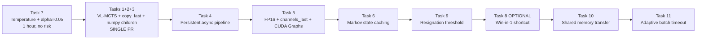

# AlphaZero Gomoku — Pipeline Optimization Plan (11 Tasks)

**Source spec:** [`alphazero_gomoku_optimization_guide.md`](../alphazero_gomoku_optimization_guide.md:1)
**Predecessor:** [`plans/alphazero_gomoku_upgrade_plan.md`](alphazero_gomoku_upgrade_plan.md:1) — *Phases A & B already landed; this plan is the next logical step.*
**Target hardware:** 12-core CPU + 1× NVIDIA V100 16 GB
**Status:** Specification + concrete file/line mapping — no code changes yet.

---

## 0. Executive Summary

The codebase is **architecturally healthy**: it already runs a centralized batched GPU evaluator with CPU MCTS workers, uses a 10×128 ResNet, SGD + Nesterov + AMP, and ships sane Phase-A hyperparameters. What it does **not** yet do is everything that turns this into a *paper-grade* asynchronous pipeline:

| Gap | Where | Impact |
|---|---|---|
| MCTS is **single-leaf-per-NN-call** | [`mcts_alphaZero.py`](../mcts_alphaZero.py:103) — `MCTS._playout` | GPU evaluator's effective batch ≤ `num_workers`. With 10 workers and `eval_batch_size=128`, batches are ~10 — **GPU is starved**. |
| Workers + evaluator **respawned every batch** | [`train_gpu_evaluator.py`](../train_gpu_evaluator.py:394) — `collect_selfplay_data_remote_gpu` | 30+ s of CUDA-init / model-load overhead per ~24 s of useful work. |
| `copy.deepcopy(state)` per playout | [`mcts_alphaZero.py`](../mcts_alphaZero.py:143) | Top-3 hot function in self-play CPU profile. |
| **Fixed temperature** throughout self-play | [`game.py`](../game.py:196) — `start_self_play` | Opening positions are repetitive → biased replay buffer. |
| Dirichlet α tuned for Go (0.03) | [`mcts_alphaZero.py`](../mcts_alphaZero.py:173) default | Should be ≈ `10 / avg_legal_moves` = **0.05** for Gomoku 15×15. |
| **No FP16/CUDA Graphs** in evaluator | [`policy_value_net_pytorch.py`](../policy_value_net_pytorch.py:170) — `policy_value` | Leaving 1.5–3× inference speed on the table on V100. |
| `current_state()` rebuilds 4 planes from scratch | [`game.py`](../game.py:51) | Every leaf preparation reconstructs O(stones) arrays. |

After implementing the **P0 chain (7 → 1+2+3 → 4)** the trainer should be ~5–10× faster wall-clock, and after P1 (Task 5) another ~1.5–2×.

> **Crucial observation about the existing code:** the new guide assumes Phase A & B from [`plans/alphazero_gomoku_upgrade_plan.md`](alphazero_gomoku_upgrade_plan.md:1) are already in. They are. So we can dive straight into Task 7 and the P0 chain without revisiting network architecture.

---

## 1. What's already in place vs what the guide asks for

| Guide assumption | Codebase reality | Status |
|---|---|---|
| 10×128 ResNet | [`ResNet`](../policy_value_net_pytorch.py:45) | ✅ done |
| 4-channel input (no history planes) | [`Board.current_state`](../game.py:51) | ✅ correct for Gomoku — **do NOT add 17 history planes**, contradicts §1.3 of the guide |
| SGD + Nesterov + grad clip + weight decay | [`PolicyValueNet.__init__`](../policy_value_net_pytorch.py:129) | ✅ done |
| AMP in trainer | `GradScaler` / `autocast` in [`PolicyValueNet`](../policy_value_net_pytorch.py:136) | ✅ done |
| `c_puct=3.0`, `eval_n_playout=1600`, `n_playout=800` | [`TrainPipeline.__init__`](../train_gpu_evaluator.py:302) defaults | ✅ done |
| Dirichlet α | default `0.03` in [`MCTSPlayer`](../mcts_alphaZero.py:173) | ⚠️ should be 0.05 (Task 7) |
| Temperature schedule (τ=1 then τ→0) | fixed `temp=temp` in [`Game.start_self_play`](../game.py:196) | ❌ Task 7 |
| Virtual-loss leaf-parallel MCTS | running-mean Q in [`TreeNode`](../mcts_alphaZero.py:48) — no virtual loss | ❌ Task 1 |
| `Board.copy_fast` | only `copy.deepcopy` exists | ❌ Task 2 |
| Numpy children arrays in TreeNode | Python dict `_children` | ❌ Task 3 |
| Persistent async pipeline | spawn-every-batch in [`collect_selfplay_data_remote_gpu`](../train_gpu_evaluator.py:394) | ❌ Task 4 |
| FP16 + channels_last + CUDA Graphs in evaluator | FP32 eager forward in [`policy_value`](../policy_value_net_pytorch.py:170) | ❌ Task 5 |
| Markov state caching | recomputes `square_state` from `self.states` dict | ❌ Task 6 |
| Win-in-1 shortcut | none | ❌ Task 8 (optional) |
| Resignation threshold | none | ❌ Task 9 |
| Shared-memory state transfer | `mp.Queue.put(state_array)` (pickled) | ❌ Task 10 |
| Adaptive batch timeout | fixed `eval_timeout_ms=8` | ❌ Task 11 |

---

## 2. Recommended Execution Order

The guide's recommended order, with the codebase's specifics layered in:



**Why this order is right for THIS codebase:**

- Task 7 is a 1-hour change that doesn't touch any hot path; lands first as a baseline data-quality win.
- Tasks 1+2+3 must be a single PR — they all rewrite [`mcts_alphaZero.py`](../mcts_alphaZero.py:1)'s `TreeNode` storage. Splitting them creates a transitional broken state.
- Task 4 alone gives the biggest pipeline-level win (no more 30 s spawn cost per batch).
- Task 5 only pays after Task 4 because CUDA Graphs need a long-lived process.
- Tasks 6, 8, 9 are quality-of-life refinements once the spine is in place.
- Tasks 10, 11 are diminishing-returns — only do if profiling proves them worth it.

---

## 3. Task-by-task File/Line Mapping

### Task 7 — Temperature schedule + Dirichlet α=0.05 (P0, fastest)

**Files & lines:**
- [`game.py:196`](../game.py:196) — `Game.start_self_play(temp=1e-3)` — replace `temp` with a `temperature_moves` schedule.
- [`mcts_alphaZero.py:173`](../mcts_alphaZero.py:173) — `MCTSPlayer.__init__` default `dirichlet_alpha=0.03` → **0.05**.
- [`train_gpu_evaluator.py:307`](../train_gpu_evaluator.py:307) — `TrainPipeline.__init__` default `dirichlet_alpha=0.03` → **0.05**.
- [`train_gpu_evaluator.py:677`](../train_gpu_evaluator.py:677) — CLI default `--dirichlet-alpha 0.03` → **0.05**.
- [`train_gpu_evaluator.py:270`](../train_gpu_evaluator.py:270) — pass new `temperature_moves` arg into `game.start_self_play(...)`.

**New CLI args (in [`train_gpu_evaluator.py`](../train_gpu_evaluator.py:666) `parse_args`):**
```python
p.add_argument("--temperature-moves", type=int, default=8)
```

**Critical bug-trap:** `Game.start_self_play` appends `self.board.current_state()` directly. Once Task 6 makes `current_state` return an internal reference, this loop must `.copy()` — but for Task 7 alone the existing implementation is already a fresh ndarray, so no copy is needed yet. **Add an explicit `.copy()` now anyway** so Task 6 doesn't silently corrupt training data later. See Pitfall §6.4 of the guide.

**Validation:** entropy of `mcts_probs` over the first 8 plies of self-play should rise materially; replay buffer should contain dozens of distinct opening sequences instead of a handful.

---

### Tasks 1 + 2 + 3 — Virtual-loss MCTS + `Board.copy_fast` + numpy children arrays (P0, single PR)

**Why one PR:** all three rewrite the *same* TreeNode storage. Splitting forces an intermediate state where either virtual loss is broken or the dict-vs-array invariants are violated.

#### Task 2 — `Board.copy_fast()` ([`game.py:10`](../game.py:10))

Add to `Board`:
```python
def copy_fast(self):
    new = Board.__new__(Board)
    new.width = self.width
    new.height = self.height
    new.n_in_row = self.n_in_row
    new.players = self.players
    new.states = dict(self.states)
    new.availables = list(self.availables)
    new._available_set = set(self._available_set)
    new._available_pos = dict(self._available_pos)
    new.current_player = self.current_player
    new.last_move = self.last_move
    return new
```
> ⚠ **Don't forget `_available_set` and `_available_pos`** — the existing [`Board.do_move`](../game.py:72) at lines 76-83 mutates them. The guide's skeleton omits this because it predates the codebase having those structures. Missing these will silently corrupt `availables` indexing.

After Task 6 lands, also clone `_planes` and `_last_move_loc`.

#### Task 1 — Virtual-loss leaf-parallel MCTS ([`mcts_alphaZero.py`](../mcts_alphaZero.py:1) full rewrite)

Rewrite `TreeNode` from running-mean `_Q` to (W, N) storage so virtual loss is reversible. Replace `MCTS._playout` (line 103) with the batched `get_move_probs` from §3 Task 1 of the guide. Key constraints specific to this codebase:

- Replace [`copy.deepcopy(state)`](../mcts_alphaZero.py:143) with `state.copy_fast()`.
- The `policy_value_fn` returned by `RemotePolicyValueClient` ([`train_gpu_evaluator.py:85`](../train_gpu_evaluator.py:85)) returns `zip(legal_positions, act_probs[legal_positions])`. The new batched API must return *full* `act_probs` arrays for the new MCTS to slice by `state.availables`. Add `policy_value_batch_fn` returning `(B, board_size)` priors and `(B,)` values.
- `MCTSPlayer.get_action` ([`mcts_alphaZero.py:185`](../mcts_alphaZero.py:185)) needs the new `policy_value_batch_function` constructor arg threaded through.
- Sign convention: Pitfall §6 of the guide is real. Validate visit-count equivalence on a 3×3 toy with `vl_k=1, n_vl=0` against the current implementation **before** integrating.

**Hyperparameters to expose** (defaults per guide §4):

| Param | Default | Where |
|---|---|---|
| `vl_k` | 4 | new in `MCTS`, `MCTSPlayer`, `TrainPipeline`, CLI |
| `n_vl` | **1.0** (NOT 3 — see Pitfall §6.1) | same chain |
| `max_oversample` | 3 | same chain |

#### Task 3 — Numpy children arrays in `TreeNode`

Use the §3 Task 3 design (parent stores `_children_actions`, `_priors`, `_N_arr`, `_W_arr`, `_child_nodes`). Backup mutates `parent._N_arr[idx]` and `parent._W_arr[idx]`. Dirichlet noise application at root must touch `self._root._priors`, not `_W_arr` — see Pitfall §6.3.

#### `RemotePolicyValueClient` — add batched API ([`train_gpu_evaluator.py:70`](../train_gpu_evaluator.py:70))

Add `policy_value_batch_fn(states_np)` per guide §3 Task 1. The simple version (B individual `request_queue.put`s, gather by `request_id`) is sufficient — the GPU evaluator already coalesces.

**Validation gate before merging:**

1. Toy-game (3×3 tic-tac-toe, deterministic `policy_value_fn`) visit-count equivalence with `vl_k=1, n_vl=0`.
2. 50-game match new (`vl_k=4, n_vl=1.0`) vs old (`vl_k=1, n_vl=0`): win rate must be ≥ 50% ± noise.
3. GPU evaluator avg batch size in steady state with 10 workers must rise from ~10 → ~40+.

---

### Task 4 — Persistent async self-play pipeline (P0)

**File:** [`train_gpu_evaluator.py`](../train_gpu_evaluator.py:1) — major refactor of `TrainPipeline`.

Replace `collect_selfplay_data_remote_gpu` ([line 394](../train_gpu_evaluator.py:394)) and `run` ([line 628](../train_gpu_evaluator.py:628)) with the persistent design from guide §3 Task 4.

**Concretely:**

1. Move evaluator + worker process spawning out of the per-batch path into `TrainPipeline.__init__` — start them once, keep them alive for the whole training run.
2. Replace `output_queue` (per-batch result drop) with `replay_queue` — workers `put(augmented_game_tuples)` continuously.
3. Add a `weight_event` (`mp.Event`) and a `weights_path` (`/dev/shm/policy_latest.pt`). Trainer writes weights and sets the event every `weight_push_every` updates (default 4); evaluator hot-reloads `state_dict` in-place.
4. Reinterpret `game_batch_num` as `target_updates` — the loop is now driven by *gradient updates*, not by *batches of self-play games*.
5. The trainer loop ([line 628](../train_gpu_evaluator.py:628)) becomes:
   ```
   drain replay_queue (with timeout) → buffer
   if buffer big enough: policy_update()
   every weight_push_every: write weights, set weight_event
   every check_freq: persist current_policy.model
   every eval_every: run policy_evaluate vs MCTS_Pure  (KEEP this — see Pitfall §6.9)
   ```
6. Add **best-vs-current gating** as an *additional* eval (not a replacement for `MCTS_Pure`):
   ```
   every eval_every updates:
     run new vs best 50 games
     if new wins ≥ 55%: copy current_policy.model → best_policy.model, broadcast
   ```
   (See Pitfall §6.9: keep `MCTS_Pure` as a sanity check at lower frequency.)

**Crash recovery:** trainer must monitor `worker_proc.is_alive()` every minute and respawn dead workers. See guide Pitfall §6.7. The current code's per-batch model is implicitly self-healing (next batch starts fresh); persistent workers need explicit handling.

**New CLI args:**
```python
p.add_argument("--weight-push-every", type=int, default=4)
p.add_argument("--eval-every", type=int, default=100)
p.add_argument("--target-updates", type=int, default=20000)
```

**Subtle but important:** with persistent workers, [`save_cpu_model_for_evaluator`](../train_gpu_evaluator.py:365) is called only on weight-push events, not before every batch. The evaluator detects the event and reloads. **Workers don't reload anything** — they only talk to the evaluator. This is a one-process update event, not an M+1-process event.

**Validation:**
- 10-min run produces ≥ 2× more games than the synchronous baseline.
- `nvidia-smi dmon` shows GPU util > 60% in steady state (vs current sawtooth).
- Ctrl-C cleanly tears down all workers + evaluator within 30 s.
- `replay_queue` never empty for > 30 s in steady state.

---

### Task 5 — GPU evaluator inference optimizations (P1)

**Files:**
- [`policy_value_net_pytorch.py`](../policy_value_net_pytorch.py:170) — add `policy_value_inference()` method on `PolicyValueNet` for the evaluator-only FP16 + `channels_last` path.
- [`train_gpu_evaluator.py`](../train_gpu_evaluator.py:124) — `gpu_evaluator_loop` (after Task 4 it becomes `persistent_evaluator_loop`).

**Subtasks (all from guide §3 Task 5):**

1. **5a — FP16 + `channels_last`:** in evaluator process only. Trainer keeps FP32 + AMP autocast.
   ```python
   net.policy_value_net = net.policy_value_net.to(memory_format=torch.channels_last).half()
   ```
   Re-apply after every weight reload — see guide §3 Task 5 reload snippet.

2. **5b — CUDA Graphs:** capture a fixed-size graph at `eval_batch_size`. After every weight reload, **assert `data_ptr()` invariance** (see the `old_id == new_id` snippet in the guide); if it fails, recapture (cheap, ~200 ms).
   - Wire this with `--use-cuda-graphs` flag (default `True`, fall back to eager on capture failure).

3. **5c — `eval_batch_size = 256`:** bump default in [`train_gpu_evaluator.py:305`](../train_gpu_evaluator.py:305) from 128 → 256.

**Strictly do NOT mix AMP autocast inside the captured region** — see Pitfall §6.8. The evaluator is pure FP16 forward (no scaler, no autocast). AMP belongs only in `train_step`.

**Validation:** 50-game match FP32-trained-FP16-eval vs FP32-trained-FP32-eval: gap < 2 Elo.

---

### Task 6 — Markov state caching in `Board` (P2)

**File:** [`game.py:51`](../game.py:51) — `Board.current_state` and [line 72](../game.py:72) — `Board.do_move`.

Maintain `self._planes` (4×H×W float32) incrementally inside `do_move`. `current_state` only needs to fill `planes[3]` (color-to-play) at read time.

**Caveat for `copy_fast` (Task 2):** must add `new._planes = self._planes.copy()` and `new._last_move_loc = self._last_move_loc`. The `.copy()` is mandatory — without it MCTS playouts mutate the *real* board's planes.

**Caveat for `start_self_play` (Task 7):** the loop at [`game.py:208`](../game.py:208) does `states.append(self.board.current_state())`. After Task 6, `current_state()` returns an internal reference. **Must `.copy()`** — else all stored states point to the final position. See Pitfall §6.4. (Already added defensively in Task 7 above.)

The current `current_state()` does `square_state[:, ::-1, :]` (a height flip via slicing). Preserve this convention in the incremental version, or remove the flip — but be consistent across get/save and the network's spatial axes. Map the `move → (h, w)` indexing carefully; the existing code uses `move // width` for `h` (row major) — Task 6's `do_move` patch must match.

**Validation:** byte-identical `current_state()` arrays for 100 random board sequences before/after.

---

### Task 9 — Resignation threshold (P2)

**Files:**
- [`mcts_alphaZero.py`](../mcts_alphaZero.py:168) — `MCTSPlayer` exposes `self.last_root_value = self.mcts._root.Q()` after each `get_action`.
- [`game.py:196`](../game.py:196) — `start_self_play` accepts `v_resign` and `disable_resign` flags.
- [`train_gpu_evaluator.py`](../train_gpu_evaluator.py:1) — trainer maintains rolling FP-rate window over no-resign games and adjusts `v_resign` (clamp to `[-0.95, -0.5]`, init `-0.85`).

**Initial values:** `v_resign = -0.85`, `disable_resign_prob = 0.10`.

**Validation:** average game length drops 25–30% (Gomoku already short, but resigning saves the loser's tail moves); FP rate hovers 3–5%; 200-game match resigned-trained vs play-to-end-trained shows resigned ≥ play-to-end.

---

### Task 8 — Win-in-1 leaf shortcut (P2, OPTIONAL)

**Purity tradeoff:** see guide §3 Task 8 — skip for paper-faithful runs. **Recommend skipping** for this project unless you specifically want a wall-clock-optimized late-training boost.

If implementing:
- Add `Board.is_winning_move(move, player)` to [`game.py`](../game.py:1) — 4-direction O(16) check, no allocation.
- In MCTS, before sending a non-terminal leaf to the NN batch, scan `availables` for an immediate win; if found, expand with one-hot prior and back up `+1` directly.

---

### Task 10 — Shared-memory state transfer (P3)

**Only do this if profiling after Task 4 shows `mp.queues.put` in cProfile top-3 hot functions.**

Replace the `state_array` field in queue messages with a slot index into a `multiprocessing.shared_memory.SharedMemory` ring buffer. Free-list managed via a `ctx.Queue` of slot integers.

**Cleanup discipline:** trainer must `shm.close(); shm.unlink()` in a `finally` block — shared memory survives process exit on Linux.

---

### Task 11 — Adaptive batch timeout (P3)

**File:** [`train_gpu_evaluator.py:124`](../train_gpu_evaluator.py:124) — `gpu_evaluator_loop`.

Add `AdaptiveTimeout` class as in guide §3 Task 11. Track recent fill-ratio over a 100-batch deque; nudge `timeout_ms` up if fills < 40%, down if > 85%. Bounds: `[1, 30]` ms.

---

## 4. Configuration After All Tasks (Gomoku 15×15)

| Param | Old default | New default | Notes |
|---|---|---|---|
| `num_workers` | 10 | 16 | More inflight → larger batches |
| `n_playout` (self-play) | 800 | 800 | Unchanged |
| `eval_n_playout` | 1600 | 1600 | Unchanged |
| `vl_k` | n/a | 4 | New (Task 1) |
| `n_vl` | n/a | **1.0** | NOT 3 (see Pitfall §6.1) |
| `max_oversample` | n/a | 3 | New |
| `c_puct` | 3.0 | 3.0 | Unchanged |
| `dirichlet_alpha` | 0.03 | **0.05** | Adapted to Gomoku 15×15 (Task 7) |
| `noise_eps` | 0.25 | 0.25 | Unchanged |
| `temperature_moves` | n/a | 8 | New (Task 7) |
| `eval_batch_size` | 128 | 256 | Larger states fit in mem |
| `eval_timeout_ms` | 8 | 8 (init) | Adaptive (Task 11) |
| `batch_size` (train) | 512 | 512 | Unchanged |
| `buffer_size` | 500 000 | 1 500 000 | Wider replay window |
| `recent_sample_window` | 200 000 | 500 000 | ~1800 distinct games |
| `weight_push_every` | n/a | 4 (updates) | New (Task 4) |
| `eval_every` | 50 (batches) | 100 (updates) | Reinterpreted |
| `v_resign` | n/a | -0.85 | Auto-tuned (Task 9) |
| `disable_resign_prob` | n/a | 0.10 | New (Task 9) |

---

## 5. Validation / Acceptance Gates

A task is "merged" only when all three pass:

1. **Sanity (per-task):**
   - Task 7: opening diversity in buffer rises (`>= 30` distinct opening prefixes in 100 games).
   - Tasks 1+2+3: visit-count equivalence on toy game (3×3, deterministic).
   - Task 4: graceful Ctrl-C; no orphan processes after 30 s.
   - Task 5: FP16 vs FP32 < 2 Elo.
   - Task 6: byte-identical `current_state()`.
   - Task 9: average episode length drops; FP rate ≈ 3–5%.

2. **Throughput:** 30-min benchmark from a fixed checkpoint. Must not regress and should improve per the guide §5.1 expectations:
   - Tasks 1+2+3: games/30-min × 2; avg evaluator batch × 4.
   - Task 4: another 1.5–2× on top of that.
   - Task 5: another 1.5–2× on top of that.

3. **Strength:** 200-game match new vs old, both from the *same* initial checkpoint, *same* wall-clock budget, 1600 simulations/move at match time. New ≥ old at p < 0.05 (i.e., new wins ≥ 113/200).

---

## 6. Risk Register (codebase-specific)

| Risk | Likelihood | Mitigation |
|---|---|---|
| `Board.copy_fast` misses `_available_set` / `_available_pos` | High | Explicitly listed in §3 Task 2; add a unit test that does `do_move` on a copy and asserts the original's `availables` is unchanged. |
| Sign-flip bug in virtual-loss backup | High | Toy-game equivalence test before merging Tasks 1+2+3. |
| `current_state` reference vs copy after Task 6 | High | Pre-emptive `.copy()` added in Task 7. Also unit-assert `np.any(states[0] != states[-1])` after one game. |
| CUDA Graphs + `load_state_dict` reallocation | Medium | `data_ptr()` assert in `weight_event` handler; recapture on fail. |
| Persistent worker silently dies | Medium | `worker_proc.is_alive()` poll every 60 s in trainer loop; respawn. |
| `policy_value_fn` API change breaks `policy_evaluate` (vs `MCTS_Pure`) | High | Keep the legacy single-state `policy_value_fn` on both `RemotePolicyValueClient` and `PolicyValueNet`. Eval path uses local `PolicyValueNet.policy_value_fn` ([`policy_value_net_pytorch.py:187`](../policy_value_net_pytorch.py:187)) — unaffected. |
| Removing `MCTS_Pure` eval breaks regression detection | Medium | **Do not remove** — see Pitfall §6.9. Add best-vs-current as additional gate, not replacement. |
| Old `current_policy.model` checkpoint becomes stale during persistent run | Low | Trainer still calls `save_model("./current_policy.model")` every `check_freq`. |

---

## 7. Effort & Sequencing (no time estimates per workspace rules)

| Order | Task(s) | PR scope |
|---|---|---|
| 1 | Task 7 | Single small PR — 3 files, new CLI flag |
| 2 | Tasks 1 + 2 + 3 | One large PR — `mcts_alphaZero.py` rewrite + `Board.copy_fast` + batched client API |
| 3 | Task 4 | Major PR — `train_gpu_evaluator.py` refactor; uses Tasks 1–3 |
| 4 | Task 5 | Self-contained PR on top of 4 |
| 5 | Task 6 | Self-contained, but coordinate with Task 7's defensive `.copy()` |
| 6 | Task 9 | Cuts across 3 files but each change is small |
| 7 | Task 8 (OPTIONAL) | Skip unless wall-clock matters more than purity |
| 8 | Task 10 | Only if profiling after Task 4 demands it |
| 9 | Task 11 | Quality-of-life refinement |

After steps 1–4 the trainer matches the paper's described architecture, properly adapted for Gomoku. Steps 5–9 are incremental.

---

## 8. Pre-implementation Checklist (run before Code mode handoff)

- [ ] Run `npx gitnexus analyze` — index is currently 4 commits behind HEAD.
- [ ] Run `gitnexus_impact({target: "TreeNode", direction: "upstream"})` — confirm only `MCTS`, `MCTSPlayer`, and tests touch it.
- [ ] Run `gitnexus_impact({target: "Board", direction: "upstream"})` — many callers; the `copy_fast` addition is purely additive (low risk).
- [ ] Run `gitnexus_impact({target: "policy_value_fn", direction: "upstream"})` — verify all sites that consume it (some may pass a local PolicyValueNet method, not the remote client).
- [ ] Save a baseline checkpoint **before** Task 1 lands so 200-game strength matches have a stable opponent.
- [ ] Stand up a 5-minute smoke-test command (per guide Appendix C) and verify it green-lights against current `main` before any task lands.

---

## 9. References

- [`alphazero_gomoku_optimization_guide.md`](../alphazero_gomoku_optimization_guide.md:1) — full design spec for all 11 tasks.
- AlphaGo Zero paper (Silver et al., *Nature* 550, 2017) — specifically the *Methods → Search algorithm* and *Self-play training pipeline* sections.
- [`plans/alphazero_gomoku_upgrade_plan.md`](alphazero_gomoku_upgrade_plan.md:1) — predecessor plan (network architecture); Phases A & B already merged; Phase C 17-channel history is **superseded** by §1.3 of the new guide ("Markov property → do not add history planes").
